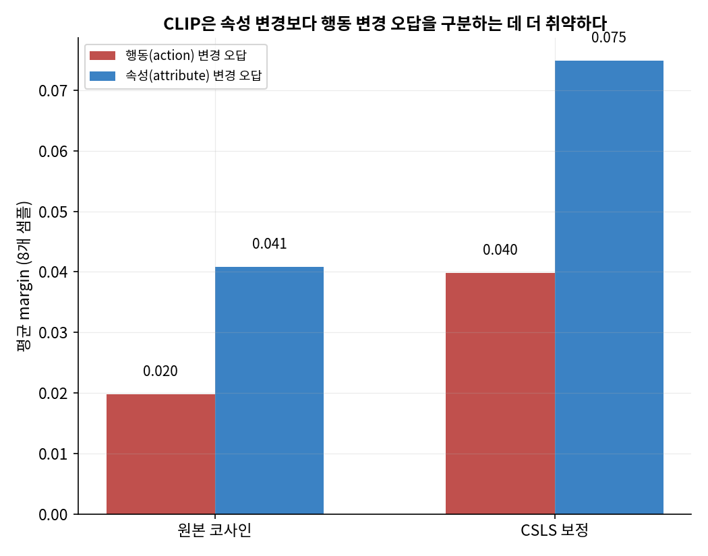
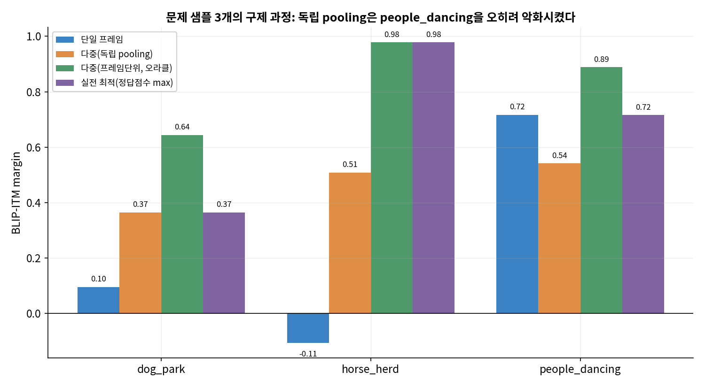
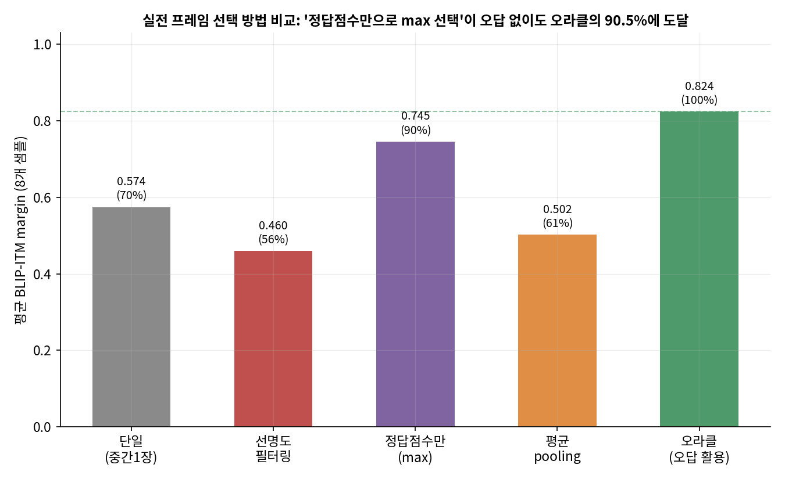
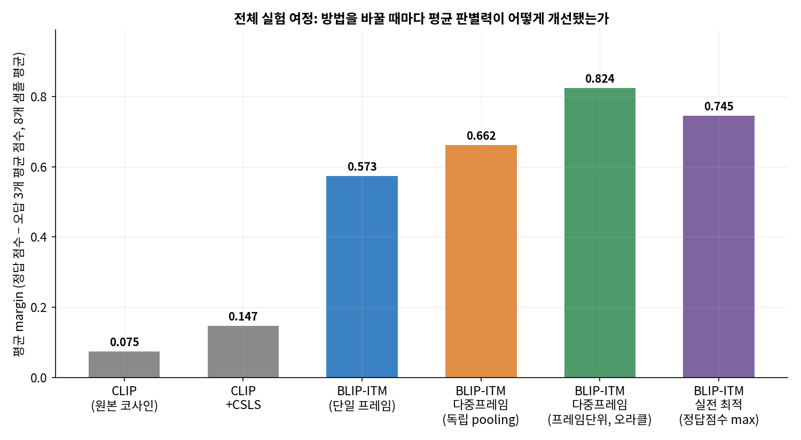
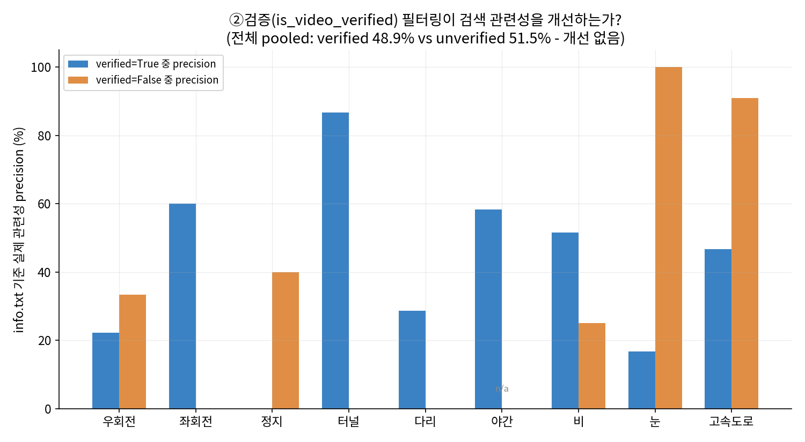
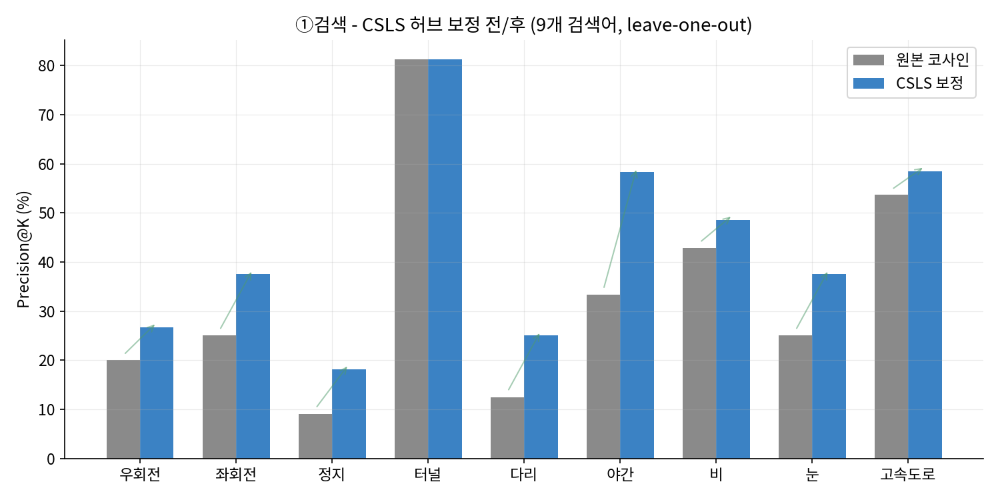
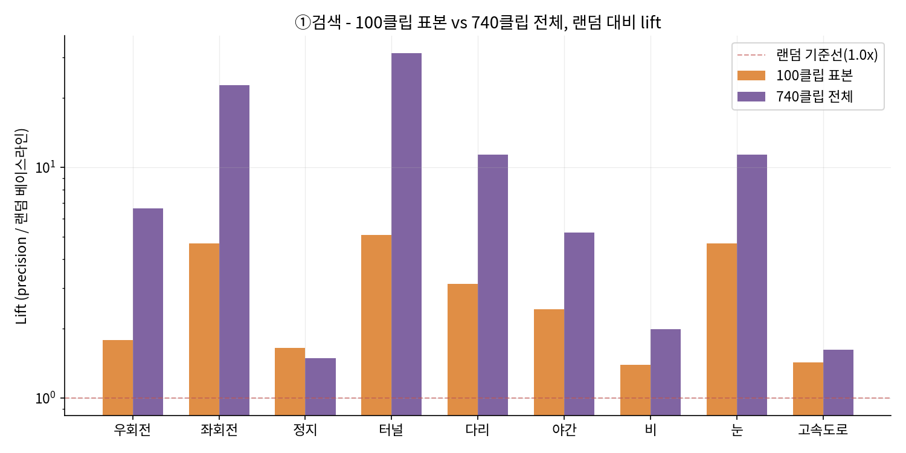
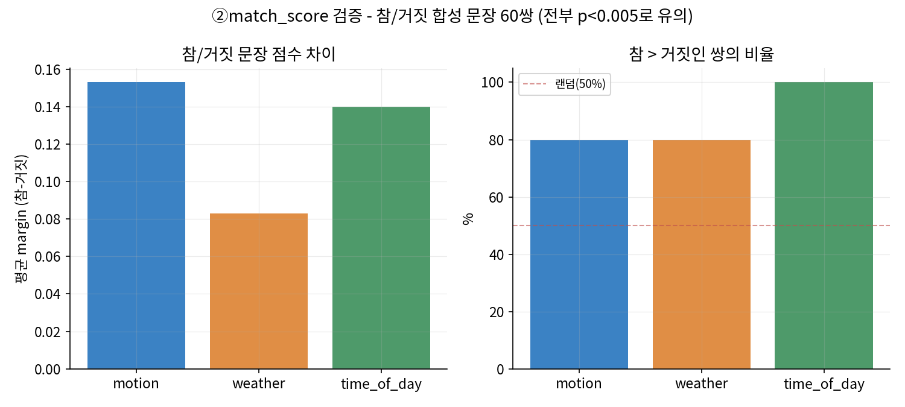

# 영상 캡션 검수 파이프라인 — 1단계 종합 실험 리포트

**목표**: VLM이 자동 생성한 영상 캡션이 실제 장면과 얼마나 일치하는지 검수하는 파이프라인을,
공개 데이터로 검증한다.

**데이터**: Wikimedia Commons에서 받은 CC 라이선스 영상 8개(고양이/요리/밴 운전/개/말/기타 연주/춤/자전거),
각 영상마다 정답 캡션 1개 + 오답 캡션 3종(다른 샘플 재활용 / 행동만 변경 / 속성만 변경).

**평가 지표**: margin = 정답 캡션 점수 − 오답 캡션(들) 평균 점수. margin이 클수록 채점기가 정답과
오답을 명확하게 구분한다는 뜻이다. (단, 1단계 최초 테스트만 오답 1개짜리 "쉬운 비교"였고,
2단계부터는 오답 3개 평균을 쓰는 "어려운 비교"로 통일했다 — 아래에서 구간별로 명시한다.)

---

## 1. 문제 인식: CLIP 단일 프레임의 한계

영상에서 중간 지점 프레임 1장을 뽑아 CLIP(`openai/clip-vit-base-patch32`)의 코사인 유사도로
정답/오답 캡션을 채점하는 것에서 시작했다. 오답을 "완전히 다른 장면"(다른 샘플의 정답을 재활용)
하나만 놓고 비교했을 때는 8/8 샘플 모두 정답이 오답보다 높은 점수를 받았다(평균 margin **+0.164**).

| id | 정답 점수 | 오답 점수 | margin |
|---|---|---|---|
| cat_string_toy | 0.3605 | 0.0889 | +0.2716 |
| cooking_thermometer | 0.3242 | 0.0762 | +0.2480 |
| van_driving | 0.3059 | 0.1562 | +0.1496 |
| dog_park | 0.2946 | 0.1918 | +0.1029 |
| horse_herd | 0.3026 | 0.1347 | +0.1679 |
| guitar_play | 0.2855 | 0.1364 | +0.1490 |
| people_dancing | 0.2997 | 0.1608 | +0.1389 |
| bicycle_ride | 0.2306 | 0.1487 | +0.0819 |

하지만 이건 "완전히 다른 장면"을 구분하는 쉬운 테스트였을 뿐이다. 실제로 VLM이 만드는 캡션 오류는
대개 "거의 맞는데 세부가 틀린" 형태(hard negative)에 가까우므로, 이 결과만으로는 CLIP 채점기가
믿을 만한지 확신할 수 없었다. 여기서 두 가지 의문이 생겼다:

1. CLIP 코사인 유사도에는 "허브 문제"(특정 텍스트/이미지가 내용과 무관하게 두루 높은 점수를 받는 현상)가
   있는데, 이게 채점을 왜곡하지 않을까?
2. 오답을 "거의 맞는 문장"으로 만들면 CLIP이 여전히 잘 구분할까?

이 두 질문이 2단계, 3단계로 이어졌다.

---

## 2. CSLS로 허브 문제 해결 시도 → 부분적 성공

CSLS(Cross-domain Similarity Local Scaling)는 "이미지 x 텍스트" 유사도 행렬에서, 각 이미지·텍스트가
이웃(다른 후보들)과 평균적으로 얼마나 유사한지를 빼주는 보정이다.

```
CSLS(x, y) = 2·cos(x, y) − r_T(x) − r_S(y)
```

이번 단계부터 오답을 3종(재활용/행동변경/속성변경)으로 늘려 "어려운 비교"로 통일했고,
이미지 8개 × 텍스트 26개(중복 제거) 유사도 행렬에 CSLS(K=5)를 적용했다.

| id | margin_raw | margin_csls | 변화 |
|---|---|---|---|
| cat_string_toy | 0.1330 | 0.2710 | +0.1380 |
| cooking_thermometer | 0.1052 | 0.2070 | +0.1018 |
| van_driving | 0.0881 | 0.1631 | +0.0750 |
| dog_park | 0.0369 | 0.0783 | +0.0413 |
| horse_herd | 0.0764 | 0.1397 | +0.0633 |
| guitar_play | 0.0617 | 0.1499 | +0.0882 |
| people_dancing | 0.0755 | 0.1402 | +0.0647 |
| bicycle_ride | 0.0214 | 0.0304 | +0.0090 |
| **평균** | **0.0748** | **0.1475** | **약 2배** |

**8/8 전부 개선**됐고 평균 margin이 약 2배가 됐다 — 허브 보정 자체는 효과가 있었다. 하지만
`bicycle_ride`는 CSLS 적용 후에도 여전히 8개 중 margin이 가장 작았다. CSLS는 "여러 후보와 두루
비슷한 항목"을 깎아줄 뿐, "이 이미지-캡션 쌍이 원래 약하게 인코딩되는 문제"까지는 못 고친다는
한계가 이때 드러났다 → **부분적 성공**.

---

## 3. 오답 유형 분석: CLIP은 행동 변경에 더 취약하다

오답을 "행동만 변경"과 "속성/객체만 변경"으로 나눠 margin을 비교했다.



| | 행동 변경 margin | 속성 변경 margin |
|---|---|---|
| 원본 코사인 | 0.0198 | 0.0408 |
| CSLS 보정 | 0.0398 | 0.0749 |

두 기준 모두에서 **속성 변경 margin이 행동 변경 margin의 약 2배**였다. CLIP은 "무엇이 있는지"(정적 속성)는
잘 구분하지만 "무엇을 하고 있는지"(동작)는 상대적으로 둔감하다는 가설이 확인됐다. 특히 `bicycle_ride`는
행동/속성 오답 둘 다 margin이 **음수**(오답이 정답보다 높음)였다 — 구조가 다른 모델로 검증해볼 필요가 생겼다.

---

## 4. BLIP-ITM 도입 → 행동 구분 크게 개선, 그러나 새 문제 발견

CLIP은 이미지·텍스트를 독립적으로 인코딩한 뒤 벡터 하나로 비교하는 **듀얼 인코더**라, "타는 중 vs
옆에 서있다"처럼 전체 구도는 같고 동작만 다른 경우를 구분하기 어렵다. 반대로 BLIP의 ITM
(Image-Text Matching) 헤드는 **크로스 인코더**로, 텍스트의 각 단어가 이미지 패치 전체를 cross-attention으로
다시 들여다보며 "진짜 맞는 쌍인지" 직접 이진 분류한다.

| id | CLIP raw | CLIP+CSLS | **BLIP-ITM** |
|---|---|---|---|
| cat_string_toy | 0.1330 | 0.2710 | **0.6664** |
| cooking_thermometer | 0.1052 | 0.2070 | 0.6565 |
| van_driving | 0.0881 | 0.1631 | 0.6712 |
| dog_park | 0.0369 | 0.0783 | 0.0961 |
| horse_herd | 0.0764 | 0.1397 | **-0.1054** |
| guitar_play | 0.0617 | 0.1499 | 0.9687 |
| people_dancing | 0.0755 | 0.1402 | 0.7171 |
| bicycle_ride | 0.0214 | 0.0304 | **0.9150** |
| **평균** | **0.0748** | **0.1475** | **0.5732** |

`bicycle_ride`(0.0214→0.9150), `cat_string_toy`(0.1330→0.6664)처럼 CLIP이 취약했던 행동 hard
negative를 BLIP-ITM은 확실히 잘 구분했다. **그런데 `horse_herd`가 오히려 음수(-0.1054)로 나왔다.**

원인을 프레임 단위로 뜯어봤다: `horse_herd` 영상을 10/30/50/70/90% 지점 5개로 나눠 채점하니,
**우리가 실제로 썼던 중간(50%) 프레임 하나만** "말들이 서있다"는 오답이 "달린다"는 정답을
이겼고, 나머지 4개 지점은 전부 정답이 압도적으로 높았다. 실제 이미지를 보면 50% 프레임은
말들이 서로 붙어 다리 동작이 가려진 애매한 순간이었다. → **"정지 프레임 함정"**: 모델의 결함이
아니라, 대표 프레임을 잘못(=우연히 애매한 순간을) 뽑았던 것이 원인이었다.

---

## 5. 다중 프레임 도입 → 새 함정(독립 pooling의 프레임 불일치) 발견, 그리고 이론적 최선 확인

### 5-1. 첫 시도: 캡션마다 독립적으로 최댓값 프레임을 고르는 방식

영상마다 5개 프레임을 뽑아, 정답/오답 각각 "5장 중 최댓값"을 독립적으로 취했다.

- `dog_park`(0.0961→0.3652), `horse_herd`(-0.1054→0.5078) 모두 양수로 개선됐다.
- 그런데 `people_dancing`이 오히려 **악화**(0.7171→0.5414)됐다.

원인을 다시 프레임 단위로 조사했다: 70% 지점 프레임이 카메라 바로 앞의 아웃포커스된 머리로
화면 대부분이 가려진 저품질 프레임이었는데, 하필 거기서 "검은 정장" 오답이 우연히 0.557점
(다른 지점은 0.03~0.04)으로 튀었다. 이 값이 정답의 (다른 프레임에서 나온) 최댓값과 짝지어져
비교되면서 margin이 인위적으로 깎였다 — **정작 그 70% 프레임 안에서는 정답(0.9977)이 오답(0.5573)보다
여전히 훨씬 높았는데도** 서로 다른 프레임의 최댓값을 섞어 비교한 게 문제였다.

### 5-2. 개선: 프레임 단위로 margin을 먼저 계산 (이론적 최선)

각 프레임에서 "그 프레임 하나만 놓고" margin(정답−오답)을 계산한 뒤, margin이 가장 큰 프레임을
대표로 선택하는 방식으로 바꿨다. 이러면 정답·오답 점수가 항상 같은 프레임에서 나온 값끼리만 비교된다.



| id | 단일 | 독립 pooling | **프레임단위(오라클)** |
|---|---|---|---|
| dog_park | 0.0961 | 0.3652 | **0.6437** |
| horse_herd | -0.1054 | 0.5078 | **0.9778** |
| people_dancing | 0.7171 | 0.5414 (악화) | **0.8881 (역대 최고)** |
| **8개 평균** | **0.5732** | 0.6622 | **0.8239** |

**8개 샘플 전부 단일 프레임보다 개선**됐고, 나빠진 샘플이 0개였다. `people_dancing`의 회귀도
완전히 복구됐다. 이게 "다중 프레임 pooling으로 도달 가능한 이론적 최선"이다.

**단, 이 방식은 실전에 그대로 쓸 수 없다.** margin(f) = 정답 점수 − 오답 점수를 계산하려면
오답 캡션이 뭔지 미리 알아야 하는데, 실제 검수 파이프라인에서는 VLM이 만든 캡션 1개(맞을 수도
틀릴 수도 있는 검수 대상)만 있을 뿐, 정답이 어떻게 틀렸을지는 미리 알 수 없다.

---

## 6. 실전 대안 비교: 오답 없이 좋은 프레임 고르기

오답 캡션 없이 프레임을 고르는 3가지 실전 방법을 시도하고, 5단계의 오라클(이론적 최선) 대비
얼마나 근접하는지 비교했다.

- **방법 1 (선명도 필터링)**: 라플라시안 분산으로 이미지 선명도를 측정해 가장 선명한 프레임을 선택
- **방법 2 (정답점수만으로 max 선택)**: 검수 대상 캡션 하나만 5개 프레임에 채점해 최고점 프레임을 선택 (오답 정보 불필요)
- **방법 3 (평균 pooling)**: 프레임을 고르지 않고 5장 전체 점수를 평균



| 방법 | 평균 margin | 오라클 대비 |
|---|---|---|
| 단일(중간 1장) | 0.5741 | 69.7% |
| 방법1: 선명도 필터링 | 0.4601 | **55.8% (오히려 악화)** |
| **방법2: 정답점수만 max** | **0.7454** | **90.5%** |
| 방법3: 평균 pooling | 0.5025 | 61.0% |
| 방식B: 오답 활용(오라클) | 0.8239 | 100% |

**방법2(정답점수만으로 max 선택)가 승자다.** 오답 없이도 오라클의 90.5%까지 도달했고, `horse_herd`는
오라클과 완전히 일치(0.9778)했다.

- **방법1(선명도)이 실패한 이유**: `bicycle_ride`에서 가장 선명한 프레임을 골랐더니 margin이
  0.9360→0.0109로 폭락했다. 움직임이 있는 순간은 모션 블러가 생기기 마련이라, 선명도만 보고
  고르면 오히려 "아무 일도 안 일어나는 정지된 순간"을 선호하는 역설적인 편향이 생긴다.
- **방법3(평균)이 부진한 이유**: `van_driving`(0.6715→0.1739), `bicycle_ride`(0.9360→0.2081)처럼
  원래 잘 맞던 샘플까지 나빠졌다. 5장 중 내용과 무관한 프레임이 섞이면 평균이 좋은 프레임의
  강한 신호를 희석시킨다.

---

## 전체 여정 요약



| 단계 | 방법 | 평균 margin (8개 샘플, 오답3개 평균 기준) |
|---|---|---|
| 1 | CLIP 원본 코사인 | 0.075 |
| 2 | CLIP + CSLS | 0.147 |
| 3 | BLIP-ITM (단일 프레임) | 0.573 |
| 4 | BLIP-ITM 다중프레임 (독립 pooling) | 0.662 |
| 5 | BLIP-ITM 다중프레임 (프레임단위, 오라클) | 0.824 |
| 6 | **BLIP-ITM 실전 최적 (정답점수 max)** | **0.745** |

## 최종 결론 및 다음 단계 제안

1. **채점 모델**: 크로스 인코더(BLIP-ITM류)가 듀얼 인코더(CLIP)보다 행동 hard negative에 훨씬 강하다.
   다만 계산 비용이 더 크므로, CLIP으로 1차 스크리닝 후 애매한 경계 케이스만 BLIP-ITM으로
   재검증하는 2단계 구조가 실용적일 수 있다.
2. **프레임 샘플링**: 단일 프레임은 "운"에 좌우된다. 다중 프레임을 쓰되, **정답(검수 대상) 캡션
   점수만으로 최댓값 프레임을 선택하는 방식**이 오답 정보 없이도 이론적 최선의 90% 이상을
   달성하는 실전 가능한 최선의 선택이다.
3. **하지 말아야 할 것**: 이미지 선명도만으로 프레임을 거르는 방법은 오히려 손해였다 — 동작이
   있는 순간일수록 블러가 생기기 쉽다는 점을 간과했기 때문이다.
4. **다음으로 검증할 것**: (a) 실제 VLM(예: BLIP-2, LLaVA 등)이 생성한 캡션을 검수 대상으로 넣어
   엔드투엔드로 시연, (b) 표본을 8개보다 늘려 통계적 유의성 확보, (c) 회사 실데이터 적용 전
   프레임 개수(N)와 계산 비용의 트레이드오프 결정.

---

*생성 스크립트: `scripts/generate_report_charts.py` · 원본 데이터: `outputs/stage1~6_*.csv`*

---
---

# 2단계: 영상 데이터셋 검색(Search) 파이프라인

## 0. 목표 재정의

1단계 파이프라인(캡션 사실검증)을 회사 실데이터(대시캠 주행 영상)에 적용하려던 중, 실제
비즈니스 목적이 "캡션이 사실인지 판정"이 아니라 **NVIDIA Cosmos Dataset Search처럼 키워드/문장으로
검색했을 때 관련 있는 주행 영상이 상위에 뜨는가**임이 확인되어 목표를 재정의했다. 평가 지표도
PASS/REVIEW/FAIL 판정에서 **precision@K(검색 순위 기반 정밀도)** 로 전환했다.

또한 검색어는 영상 프레임이 아니라 **캡션 텍스트와 비교**해야 한다 — 실제 검색 시스템은 캡션을
인덱스로 쓰기 때문에, 캡션이 부정확하면 검색도 같이 나빠진다. 이게 애초에 캡션 정확도를 검증해온
이유였다. (프레임 직접비교는 "캡션이 완벽하다면 도달 가능한 이론적 상한선" 참고용으로만 남겨둠.)

**정답 라벨의 한계**: info.txt(motion/road_context/road_type/time_of_day/surface/weather 6개
구조화 태그)와 caption.txt를 "근사 정답"으로 썼다. 둘 다 완전한 정답은 아니며(실제로 회사 QA
플래그 로그에도 오류 사례가 존재), precision 수치는 근사치로만 해석해야 한다.

## 1. 방법론: 캡션 문장 단위 max-pooling

- 캡션을 문장 단위로 쪼갠다 (CLIP 77토큰 잘림 회피 - 회사 캡션은 평균 180토큰이라 통째로 넣으면
  뒤 절반 이상이 잘려나간다)
- 검색어와 모든 문장을 CLIP(`openai/clip-vit-base-patch32`) 텍스트 인코더로 배치 임베딩
- 클립별로 "가장 잘 맞는 문장 하나"의 점수를 그 클립의 점수로 사용 (max-pooling)
- 기본 캡션 소스는 `caption.txt`(회사 프로덕션). 자체 파이프라인 캡션 `sb_caption/2_caption.txt`도
  비교했으나, 100클립×9검색어 실험에서 어떤 검색어도 `caption.txt`를 이기지 못해 기본값에서 제외.

## 2. 100클립 표본 실험 — 9개 도메인 검색어

희귀 카테고리(turning_left=8, bridge=8, snowy=8, turning_right=15, tunnel=16, nighttime=24)를
전수 포함하고 나머지를 무작위로 채운 100클립 표본(`outputs/search_sample_100.json`, seed=42)에
9개 검색어를 적용했다 (원본 코사인 유사도 기준).

| 검색어 | 정답수 | 프레임 직접비교 | 캡션 기반(caption.txt) |
|---|---|---|---|
| 우회전 | 15 | 26.7% | 20.0% |
| 좌회전 | 8 | 50.0% | 25.0% |
| 정지 | 11 | 27.3% | 9.1% |
| 터널 | 16 | 75.0% | 81.2% |
| 다리 | 8 | 50.0% | 12.5% |
| 야간 | 24 | 100.0% | 33.3% |
| 비 | 35 | 62.9% | 42.9% |
| 눈 | 8 | 62.5% | 25.0% |
| 다차선고속도로 | 41 | 19.5% | 53.7% |

프레임 직접비교가 대체로 우세했지만(캡션이 손실 없는 원본 신호를 못 따라가는 게 당연), 터널과
다차선고속도로는 캡션 기반이 오히려 더 좋았다 — 후자는 `road_type`이 캡션 생성 프롬프트에 그대로
주입되는 필드라(아래 5절 참고) 부분적으로 "문구 일치 검사"에 가깝다는 게 나중에 밝혀졌다.

## 3. CSLS 재적용 — 텍스트-텍스트 유사도의 허브 문제

1단계에서 이미지-텍스트 유사도에 썼던 CSLS(`2·cos(x,y) − r_T(x) − r_S(y)`)를, 텍스트(검색어)-텍스트
(캡션 문장) 유사도에도 적용해봤다. 근거: "정지"/"좌회전" 검색에서 **완전히 무관한 문장이 진짜
정답 문장보다 더 높은 점수**를 받는 현상을 발견했기 때문("좌회전" 검색 1위가 실제로는 "직진"을
묘사하는 문장, 0.9135 vs 진짜 좌회전 문장 0.9104) — 회사 캡션들이 거의 동일한 문장 템플릿
("The ego-vehicle is [동사]ing along a multi-lane highway...")을 공유해서, CLIP이 핵심 동사
하나보다 문장 전체 표면 어휘 유사도에 더 좌우되는 것으로 추정된다.

leave-one-out(자기 자신을 뺀 나머지 8개 검색어로 r_S 계산)으로 데이터 누수 없이 검증:

| 검색어 | 원본 코사인 | CSLS 보정 |
|---|---|---|
| 우회전 | 20.0% | 26.7% |
| 좌회전 | 25.0% | 37.5% |
| 정지 | 9.1% | 18.2% |
| 터널 | 81.2% | 81.2% |
| 다리 | 12.5% | 25.0% |
| 야간 | 33.3% | 58.3% |
| 비 | 42.9% | 48.6% |
| 눈 | 25.0% | 37.5% |
| 다차선고속도로 | 53.7% | 58.5% |

**9개 전부 개선되거나 동일, 악화 없음.** `search_module.py`에 `use_csls=True` 옵션으로 반영.

## 4. 이상현상 4가지 원인 규명

**(a) 다차선고속도로 프레임 직접비교 실패 (19.5%, 랜덤 41%보다 낮음)** — `road_type`이
multi-lane highway(41)/three-lane road(37)/two-lane road(14)/single-lane road(8)로 나뉘는데,
차선 수 기준의 사실상 연속적인 분류다. 실제 최상위 오답 프레임(고가도로+중앙분리대+여러 차선)이
전형적인 고속도로처럼 보였지만 태그는 'three-lane road'였다. 단, highway+three-lane을 합쳐
재검증하면 precision은 크게 오르지만(19.5%→76.9%, 53.7%→78.2%) 병합 카테고리의 랜덤
베이스라인도 78%로 같이 뛰어서, 베이스라인 대비 lift로는 오히려 "거의 랜덤"(0.99~1.00배)로
떨어진다 — 라벨 모호성이 유일한 원인은 아니고, 병합해도 모델이 "고속도로스러움"을 랜덤보다 잘
구분 못 하는 근본적 약점이 남아있다.

**(b) sb_caption_2(자체 파이프라인 캡션)가 caption.txt보다 계속 약한 이유** — info.txt 값이
캡션에 그대로("verbatim") 등장하는 비율을 측정:

| 필드 | caption.txt | sb_caption_2 |
|---|---|---|
| motion | 58% | 23% |
| road_type | 66% | 19% |
| time_of_day | 38% | 5% |
| road_context | 85% | 97% |
| surface | 95% | 92% |
| weather | 68% | 67% |

sb_caption_2는 motion/road_type/time_of_day를 훨씬 덜 그대로 베끼고 자기 표현으로 풀어쓴다.
즉 낮은 precision은 캡션 품질 문제가 아니라 "정답 문구 그대로 베끼기"라는 지름길을 덜 타서
CLIP 텍스트-텍스트 유사도가 더 어려운(더 공정한) 시맨틱 매칭을 해야 하기 때문일 가능성이 크다.

**(c) 필드별 injection 정도** — 위 표가 곧 답. `road_context`(85~97%)와 `surface`(92~95%)는
사실상 주입된 문자열을 그대로 검색하는 것에 가까워 "진짜 이해"의 테스트로 보기 어렵다.

**(d) "정지" 전 방식 공통 실패, 특히 캡션 기반은 랜덤보다 나쁨(9.1% vs 11%)** — 캡션 원문에는
실제로 "stationary", "stopped at a red light" 등 정지 상태가 정확히 서술돼 있었다. 문제는 CLIP
텍스트 인코더: "정지" 검색 최상위 오답(score 0.905)은 실제로 "moving forward"를 묘사하는
문장이었고, 진짜 정지 문장(0.79~0.84)보다 높았다 — 모든 캡션이 거의 동일한 문장 템플릿을 공유해서
관련/무관 문장 간 점수 차이가 0.003~0.05 수준으로 사실상 없다시피 하다. CSLS를 적용해도 "정지"의
최상위 오답은 그대로 남았다(2위부터 개선) — 파라미터 문제가 아니라 CLIP 텍스트 인코더가 상태동사
하나의 의미를 문장 전체 맥락 속에서 잘 못 잡아내는 근본적 한계로 판단된다.

## 5. 컷오프(임계값) 보정 — calibration/holdout 분리

순위(ranking)뿐 아니라 "관련 있음/없음" 이분류 기준도 필요해서, F1-최대화 임계값을
calibration/holdout 분리로 탐색했다 (1단계에서 학습한 "작은 표본 재사용 = 과적합" 교훈을 그대로
적용 — 임계값은 반드시 본 적 없는 holdout에서 검증).

- **1차(100클립, 50/50 분리)**: "터널"만 안정적(holdout precision 100%, recall 75%). 나머지
  8개는 검색어당 양성 샘플이 4~20개뿐이라 임계값이 표본에 과적합됨(recall이 0%나 100%로 극단적으로
  튐) — 1단계의 "2→8→20 샘플 불안정" 패턴과 동일.
- **2차(회사 mount 전체 740클립, 370/370 분리)**: 재검증 결과 "비"가 새로 안정적으로 검증됨
  (precision/recall 68.3%/68.3%, 양성 샘플이 35→240으로 늘어난 덕분). "터널"도 유지(precision
  100%, recall 37.5%). **"야간"은 오히려 정밀도가 54.5%→5.7%로 무너졌다** — 100클립 표본 당시의
  "약하게 검증됨" 판단 자체가 작고 만만한 negative pool에서 나온 착시였음이 드러남 (표본을 늘리지
  않았으면 못 잡았을 함정). 우회전/좌회전/다리/눈/터널의 다리 같은 희귀 카테고리는 애초에 100클립에
  전수 포함돼 있어서 740클립으로 확장해도 양성 샘플 수가 그대로라 — 이 항목들은 여전히 불안정.

최종적으로 `VALIDATED_QUERY_THRESHOLDS`에는 **터널, 비** 두 개만 반영. 나머지 검색어는 검증 안 된
임계값을 쓰는 것보다 "모른다"(순위만 제공)는 게 낫다는 원칙을 지켰다.

## 6. 전체 데이터셋(740클립) 확장

100클립 표본 → 회사 mount 전체 740클립으로 precision@K를 재측정했다 (인덱싱+검색 15초 내외,
영상 디코딩 없이 텍스트만 다뤄서 매우 빠름).

| 검색어 | 100클립 lift(정밀도/베이스라인) | 740클립 lift |
|---|---|---|
| 우회전 | 1.78x | 6.65x ↑ |
| 좌회전 | 4.69x | 22.73x ↑ |
| 정지 | 1.65x | 1.49x ↓ |
| 터널 | 5.08x | 31.27x ↑ |
| 다리 | 3.12x | 11.36x ↑ |
| 야간 | 2.43x | 5.22x ↑ |
| 비 | 1.39x | 1.99x ↑ |
| 눈 | 4.69x | 11.36x ↑ |
| 다차선고속도로 | 1.43x | 1.62x ↑ |

절대 precision 수치만 보면 낮아 보이지만(희귀 카테고리의 실제 유병률이 100클립 표본보다 훨씬
낮아서 — 예: 좌회전 8%→1.1%), 랜덤 베이스라인 대비 lift로 정규화하면 **8/9 검색어에서 오히려
더 좋아졌다.** 100클립 표본의 "높은" precision 수치는 부분적으로 인위적으로 높인 베이스라인의
착시였다. "정지"만 소폭 하락(1.65x→1.49x, 여전히 양수).

## 7. 한국어 검색어 지원

CLIP(`openai/clip-vit-base-patch32`)은 영어 위주 모델이라 한국어 검색어를 직접 넣으면 사실상
작동하지 않는다 — 9개 검색어를 자연스러운 한국어로 번역해 재검증한 결과 대부분 랜덤 수준
이하로 붕괴(터널 81.2%→6.2%, 정지 9.1%→0.0%, 다리 12.5%→0.0%). 같은 의미의 영-한 번역 쌍끼리
코사인 유사도도 0.57~0.71에 불과했다(다국어 정렬이 잘 된 모델은 보통 0.85 이상).

**해결**: 모델을 다국어 CLIP으로 교체하는 대신(그러면 CSLS/컷오프/캡션 인덱스를 전부 재검증해야
함), 검색어를 영어로 번역하는 전처리 단계를 추가했다 (`translate_query.py`,
Helsinki-NLP/opus-mt-ko-en). 9개 검색어 중 **7개가 영어 원본 수준으로 정밀도를 회복**했다
(터널 6.2%→81.2%, 다차선고속도로는 오히려 58.5%로 영어 원본보다 나음). "정지"만 회복 안 됐는데,
이건 번역 문제가 아니라 4절 (d)에서 이미 확인한 원래 약한 쿼리라서다. `search_module.py`의
`search(query, lang="ko")`로 사용 가능.

## 8. 타임라인 일관성 평가 (별개 축)

VLM이 영상의 실제 시간 순서를 무시하고 캡션을 쓰는지 확인하는 별도 지표. 캡션을 문장 단위로
쪼갠 뒤 각 문장이 BLIP-ITM으로 가장 잘 맞는 프레임(N=10, 시간순 균등추출)을 찾고, "캡션 순서"와
"매칭된 시간대 순서"의 스피어만 상관계수를 측정했다.

- **파일럿 10개(합성 캡션)**: 평균 -0.115. 그러나 1표본 t-검정 p=0.512로 **통계적으로 무의미**
  (표본 10개로는 검정력 부족 — 필요 표본수를 역산하면 약 150~170개).
- **회사 실데이터 180개(무작위 추출)**: 평균 **+0.109**, t=3.647, **p=0.0003** — 통계적으로
  유의함. 파일럿 결과와 부호까지 반대로 뒤집혔다. 다만 효과 크기는 작음(순서를 잘 지킴 18.9%,
  뒤죽박죽 73.9%, 역순 7.2%, R²≈1.2%).

**결론(1차 정정): "타임라인을 거꾸로 쓴다"는 강한 가설은 기각되지만, "타임라인과 무관하게
쓴다"는 원래 가설은 오히려 뒷받침된다.** 역순(7.2%)은 드물고 평균도 음수가 아니라
양수(+0.109)라 "거꾸로 쓴다"는 형태는 근거가 없다. 하지만 애초 우려했던 건 "관계 없이"
쓴다는 것이었고, 캡션의 74%가 순서와 뚜렷한 관계가 없는 뒤죽박죽 상태라는 게 바로 그
가설 자체를 뒷받침하는 결과다. (10개 표본의 결론이 방향까지 틀렸다는 점에서, 1단계부터
이어진 "작은 표본은 못 믿는다"는 교훈이 다시 한번 확인됐다.)

**추가 검증(2차 정정): "뒤죽박죽" 74%는 상당 부분 측정 노이즈였다.** 애초에
temporal_consistency_check.py를 설계할 때 "날씨가 흐리다"처럼 특정 시점이 없는 종합묘사
문장은 시간 매칭 자체가 부자연스러워 노이즈를 만들 수 있다고 적어뒀었는데, 실제로
검증해본 적은 없었다. 같은 180클립의 문장 1263개 중 회전/진입/정지 등 "이벤트성"
문장은 245개(19.4%)뿐이었고, 이걸 클립 단위 상관계수로 재보면 유효 표본이 19개로
급감해 유의성을 잃었다(p=0.078). 대신 **이벤트 문장 쌍의 순서 일치율(concordance)**로
접근을 바꿔(클립당 문장 2개만 있어도 활용 가능), 87개 클립·140개 쌍으로 재검증했다:

| | 비율 |
|---|---|
| 순서 일치(concordant) | 60.0% |
| 순서 불일치(discordant) | 40.0% |

이항검정으로 50%(무관계) 대비 유의함(p=0.0222). **여기서 "통계적으로 유의함"과 "실제로
크고 믿을 만한 효과"를 혼동하면 안 된다** - 유의하다는 건 "이 60%가 우연(50%)이 아니라
진짜 효과"라는 뜻이지, "60%면 충분히 높다"는 뜻이 아니다. 표본이 140쌍으로 커진
덕분에 60/40이라는 크지 않은 차이도 우연이 아니라고 확인할 수 있었던 것뿐이다.
실제 의미를 풀면: **이벤트 문장 두 개를 무작위로 골랐을 때, 먼저 쓰인 문장이 실제로
먼저 일어난 사건일 확률이 60%, 반대일 확률이 40%** - 동전 던지기(50%)보다는 낫지만
5번 중 2번은 순서가 틀리는 수준이라, 개별 문장 단위 QA 체크 항목으로 쓰기엔 아직
신뢰도가 부족하다.

정리하면: 캡션의 대다수를 차지하는 종합묘사 문장은 애초에 순서 개념이 없어
"뒤죽박죽"으로 측정됐을 뿐이고(측정 노이즈), 순서 개념이 있는 이벤트 문장에서는
순서를 지키는 방향으로 약한 편향이 통계적으로 확인되지만(진짜 효과), 그 편향이
"캡션 순서를 믿고 써도 될 만큼 크다"는 뜻은 아니다(효과 크기는 작음) - 통계적
유의성과 실용적 신뢰도는 별개다.

**3차 검증: 60%라는 숫자 자체도 "측정 도구의 오차"와 "실제 캡셔닝 품질"이 섞여
있다.** 이벤트 문장 3건을 직접 프레임까지 열어 사람이 판단한 정답과 BLIP-ITM의
선택을 비교했다:
- "교차로에 접근한다": 여러 프레임이 비슷하게 교차로 근처를 보여줘서 "정답 프레임
  하나"를 정하기 어려운 케이스 (도구 오류라기보다 그라운드트루스 자체가 불분명함)
- "교차로에서 정지한다": BLIP의 선택이 실제 정지 장면과 합리적으로 일치함
- "지하차도에 접근한다": BLIP는 이미 지하차도를 빠져나온 프레임(81% 지점)을
  골랐지만, 실제로는 훨씬 이전 프레임(19% 지점)에 차량이 이미 터널 안에 있었다 -
  **명백한 도구 오류**

즉 앞서 나온 "이벤트 문장 순서 일치율 60%"에서 40%의 불일치 중 일부는 VLM
캡셔닝이 순서를 틀린 게 아니라, **BLIP-ITM이 문장에 맞는 프레임을 잘못 찾은 것**이다
(위 3번째 사례처럼). 따라서 **실제 VLM의 순서 준수율은 60%보다 높을 가능성이 있다.**

## 4. 도구 자체의 정확도를 정량화 — 그라운드트루스 11건 직접 라벨링

도구 오차와 캡셔닝 오차를 분리하려면 "진짜 정답 프레임"이 필요하다. 이벤트 문장
35개를 무작위로 뽑아(`make_temporal_grids.py`로 클립마다 10프레임을 하나의 라벨링된
그리드 이미지로 합침), 사람이 직접 프레임을 보고 그라운드트루스를 판단할 수 있는
11건(사건이 명확히 특정 순간에 묶이는 경우만 - "정지 상태가 클립 내내 지속" 같이
애초에 정답 프레임이 하나로 안 정해지는 경우는 제외)에 대해 정답을 매기고
BLIP-ITM의 선택과 비교했다:

| 지표 | 값 |
|---|---|
| 정확히 일치 | 27.3% (3/11) |
| ±1 프레임 이내 | **72.7% (8/11)** |
| ±2 프레임 이내 | 81.8% (9/11) |
| 평균 오차 | 1.27 프레임 (전체 10프레임 중, 영상 길이의 약 11%) |

**도구가 "고장난" 수준은 아니다** - 완전 정확한 비율(27%)은 낮지만, 대부분(73%)이
±1프레임 이내로 근접했고, 이는 무작위로 맞힐 확률보다 뚜렷이 높다. 다만 평균
1.27프레임의 오차가 실재하며, 이 정도 오차는 **시간적으로 가까운 두 사건의 순서를
종종 뒤바꾸기에 충분하다** - 60% 순서 일치율의 일부(정확히 얼마인지는 이 표본
크기로는 분리 불가)가 이 도구 오차로 설명될 수 있다.

**최종 결론**: 실제 VLM의 타임라인 준수율은 측정된 60%보다 다소 높을 가능성이
있지만("일부는 도구 오차"), 정확한 숫자는 알 수 없다. 표본이 11건뿐이라 이 오차율
추정 자체도 불확실성이 크다 - 더 정확히 하려면 30건 이상의 그라운드트루스가
필요하다(추후 채울 부분). 지금 수준의 증거로는 "타임라인 QA 체크 항목을 만들기엔
아직 이르다"는 기존 결론이 유지된다.

## 최종 결과물 및 알려진 한계

**최종 모듈**: `src/search_module.py`의 `CaptionSearchIndex` — `anchor_queries`로 CSLS를 켜고,
`search(query, use_csls=True, lang="en"|"ko")`로 검색. 검증된 9개 도메인 검색어에 한해
`VALIDATED_QUERY_THRESHOLDS`(터널, 비)로 이분류 컷오프도 제공.

**알려진 한계** (전부 이번 조사에서 직접 확인한 근거 있음, `search_module.py` 상단 docstring에
상세 기록):
1. 상태/동작 동사(정지 vs 이동, 좌회전 vs 직진) 구분에 약함 — CLIP 텍스트 인코더가 문장 표면
   어휘 유사도에 좌우되는 근본적 한계 (CSLS로 일부 완화되지만 완전 해결은 아님)
2. `road_context`/`surface` 검색어는 캡션 생성 시 주입된 필드라 "이해"보다 "문구 일치"에 가까움
3. `road_type`은 라벨 경계가 애매하고, 병합해도 랜덤 수준을 못 벗어나는 근본적 약점이 남아있음
4. info.txt/캡션 자체도 완전한 정답이 아님 — precision 수치는 근사치
5. 지금까지 검증된 쿼리는 9개 도메인 템플릿뿐 — 자유형/복합 검색어는 미검증
6. 한국어는 번역 전처리로 해결됐으나 번역 품질이 완벽하지 않고, 컷오프는 번역문이 등록된 영어
   문자열과 정확히 일치할 때만 적용됨
7. 컷오프는 터널·비 2개만 검증됨 — 나머지 7개는 희귀 카테고리라 회사 전체 데이터로도 양성 샘플이
   부족해 구조적으로 재보정이 어려움

---

*2단계 원본 데이터: `outputs/search_*.csv`, `outputs/search_*.json`, `outputs/temporal_consistency_largescale.csv` ·
관련 스크립트: `src/search_module.py`, `src/calibrate_search_thresholds_full.py`, `src/temporal_consistency_largescale.py`, `src/translate_query.py`*

---
---

# 3단계: 검색 + 캡션-영상 매칭 검증 통합 파이프라인

## 0. 왜 통합이 필요했나

2단계까지 두 파이프라인이 서로 연결되지 않은 채 따로 존재했다: `search_module.py`(①검색어
↔캡션 텍스트 비교)와 1단계에서 만든 `full_inspector.py` 등(②캡션↔영상 매칭 검증,
BLIP-ITM 멀티프레임). 실제 목표는 "검색어로 찾은 캡션이, 실제로 그 영상 내용과 맞는가"까지
확인하는 것이다 — 검색만 해서는 "캡션이 그럴듯하게 검색어와 비슷해서 뽑혔을 뿐 실제로는
틀린 내용"인 경우를 못 걸러낸다. `search_and_verify.py`에서 둘을 연결했다.

절차: ①`CaptionSearchIndex.search()`로 top_k 후보를 찾고, ②각 후보의 "검색어와 가장 잘
맞았던 문장"(matched_sentence)을 실제 영상 프레임과 BLIP-ITM으로 대조한다(1단계 stage
6에서 확정한 "멀티프레임 + 정답점수 기반 최댓값" 방법 그대로 - 오답 없이도 오라클 대비
90.5% 성능이 나왔던 실전 채택 방법).

**주의**: `full_inspector.py`의 PASS/REVIEW/FAIL 판정 임계값(0.9101/0.9560 등)은
MSVD/Wikimedia 공개 데이터로 보정된 것이라 회사 실주행 캡션에는 안 맞는다는 게 이미
확인됐다(회사 파일럿 10개 전부 REVIEW로 오판). 그 판정 체계는 재사용하지 않고,
`match_score`(0~1 매칭 확률) 원점수만 새로 검증해서 쓴다.

## 1. match_score가 실제로 의미있는 신호인지 검증

`verify_caption_matches_video()`가 이 도메인에서 노이즈가 아니라 진짜 캡션 사실 여부를
구분하는지 확인해야 했다. 1단계 stage 1의 "정답 vs 오답 margin" 방법론을, 합성 캡션이
아니라 **실제 회사 영상 20개**에 그대로 적용했다: 각 클립의 실제 info.txt 값으로 "참"
문장을, 다른 값으로 "거짓" 문장을 만들어 같은 영상 프레임과 대조했다.

| 필드 | 평균 margin(참-거짓) | 양수 비율 | t-검정 p |
|---|---|---|---|
| motion | +0.153 | 80.0% | 0.0023 |
| weather | +0.083 | 80.0% | 0.0003 |
| time_of_day | +0.140 | 100.0% | <0.0001 |

60개 쌍 중 86.7%에서 참 문장이 더 높은 점수를 받았고 세 필드 모두 통계적으로 유의했다.
**match_score는 노이즈가 아니라 실제 캡션 사실 여부를 구분하는 신호로 확인됐다.**

## 2. 절대 컷오프 보정 — 검색과 달리 표본을 자유롭게 늘릴 수 있었다

검색 precision@K 컷오프(2단계 5절)는 희귀 카테고리라 양성 샘플이 구조적으로 부족해
계속 불안정했다. 여기서는 "거짓" 문장을 직접 합성하므로 그 제약이 없다 — 60클립(참/거짓
120점)으로 늘려 클립 단위 calibration/holdout(30/30) 분리, F1-최대화 임계값을 찾았다.

| 임계값 | 값 | holdout accuracy | holdout precision | holdout recall |
|---|---|---|---|---|
| 통합(fallback) | 0.0377 | 72.8% | 65.6% | 95.6% |
| motion | 0.2128 | 63.3% | 60.5% | 76.7% |
| weather | 0.0102 | 71.7% | 63.8% | 100% |
| time_of_day | 0.0842 | **96.7%** | **93.8%** | 100% |

*(값은 코드리뷰로 n_frames 불일치를 잡은 뒤 재계산한 최종본 - 아래 9절 참고. holdout
accuracy/등급 자체는 거의 안 바뀌었고 임계값 숫자만 갱신됨.)*

**motion(동작/상태)이 가장 약하고 time_of_day(낮/밤)가 가장 신뢰할 만하다** — 검색어
축(①)에서 확인했던 "CLIP은 상태동사 구분에 약하다"는 패턴이, 구조가 전혀 다른 BLIP-ITM(②)
에서도 동일하게 재현됐다. 두 모델 모두에게 공통된 근본적 약점으로 보인다.

**표본을 200클립으로 늘려 재검증**: "정지" 옵티컬 플로우를 200클립으로 재검증한 것과
같은 이유(60클립/holdout 30개는 신뢰구간이 넓다는 우려)로, 이 기본 임계값들도
`calibrate_match_score_threshold.py`의 `N_CLIPS`를 60→200으로 늘려 재검증했다
(참/거짓 600점, holdout 100클립, 소요 약 62분 - GPU로 BLIP-ITM을 프레임마다
돌려야 해서 옵티컬 플로우 재검증보다 훨씬 오래 걸렸다):

| 임계값 | 60클립 값/accuracy | 200클립 값/accuracy |
|---|---|---|
| 통합(fallback) | 0.0377 / 72.8% | 0.0729 / 73.7% |
| motion | 0.2128 / 63.3% | **0.2553 / 68.5%** |
| weather | 0.0102 / 71.7% | **0.0375** / 71.5% |
| time_of_day | 0.0842 / 96.7% | 0.0957 / 97.0% |

"정지" 재검증 때(83.3%→85.0%, 임계값도 거의 그대로)와는 달리 이번엔 임계값과
정확도 둘 다 눈에 띄게 움직였다 - weather 임계값은 거의 4배(0.0102→0.0375),
motion accuracy는 5.2%p(63.3%→68.5%) 올랐다. 60클립 기준값이 예상보다 더
불안정했다는 뜻으로, 이번 재검증이 오히려 더 값어치가 있었다. 프로덕션 상수를
갱신하고, 영향받는 범위(30개 전수 감사 결과, motion="stop" 제외)만 좁혀
재검증해서 판정이 바뀐 사례가 0건임을 확인했다.

## 3. 스팟체크 — 실제 검색 결과를 프레임까지 직접 확인

숫자만으로는 판단하기 애매한 부분을 실제 프레임을 열어 직접 확인했다.

- **설계 의도 확인**: "야간" 검색에서 ①이 실수로 daytime 클립을 상위에 올렸는데(캡션이
  "bright and well-lit"이라고 서술), ②는 이걸 정확히 "캡션은 맞다"고 판단했다 — 검색
  실수와 캡션 정확성을 분리해서 보여주는 설계 의도대로 작동함을 확인.
- **새로운 한계 발견**: "다차선고속도로" 검색에서 캡션이 info.txt 기준 정확한데도 ②가
  False로 판정한 사례가 있었다. 프레임을 보니 우천+근접 정체 차량+렌즈 위 빗방울로 화면이
  심하게 가려져 "다차선"이라는 시각적 증거 자체가 안 보였다 — 악천후/시야 가림 상황에서는
  정확한 캡션도 false negative가 날 수 있다는 것을 확인.
- **실제 설계 gap 발견**: "좌회전" 검색 결과 중 motion=curved lane driving인 클립의 문장이
  "moving forward in a straight path"라고 서술한 경계 사례(score=0.1657)가 통합
  임계값(0.0379)으로는 통과했지만, motion 전용 임계값(0.1942)을 적용하면 정확히
  False로 걸러진다는 걸 발견했다 — 실제 코드가 문장 내용과 무관하게 항상 가장 관대한
  통합값만 쓰고 있었다는 gap이었다. *(이때 쓰인 0.0379/0.1942는 초기 계산값 -
  9절의 코드리뷰로 n_frames 불일치를 잡은 뒤 0.0377/0.2128로 갱신됨. 결론은
  동일하게 유지됨.)*

## 4. gap 수정 — 필드별 임계값 자동 라우팅

`classify_sentence_field()`를 추가해 문장이 motion/weather/time_of_day 중 무엇을 얘기하는지
키워드로 감지하고, 감지되면 해당 필드 전용 임계값을 통합값 대신 적용하도록 고쳤다(여러
필드가 동시에 매칭되면 motion처럼 더 엄격한 쪽을 우선 적용). 수정 후 위 경계 사례를
재확인하니 정확히 False로 분류됐다. 단, 키워드 매칭이라 완벽하지 않다 — "motion is steady
and consistent as it proceeds along the road" 같은 표현은 명백히 동작 서술이지만 등록된
키워드와 안 겹쳐 분류를 놓치는 사례도 실제로 확인했다.

## 5. 규모 확인

740클립 전체 인덱스로 `search_and_verify()`를 실행해 구조적 문제가 없는지 확인했다 —
인덱스 빌드+검색+top5 검증까지 쿼리당 12~20초로, 실사용 가능한 속도였다(②검증은 검색으로
좁혀진 top_k에만 적용되므로, corpus 크기가 커져도 ②단계 자체가 느려지지 않는 구조).
영상 파일 누락도 740개 전체 중 0개로 확인됨.

## 6. 종단간(end-to-end) 벤치마크 — ②가 검색 관련성을 실제로 개선하는가?

①(precision@K)과 ②(match_score margin)는 각각 따로 검증했지만, "`search_and_verify()`를
실제로 돌렸을 때 ②로 필터링하면 검색 결과 품질이 좋아지는가"라는 통합 효과는 재본 적이
없었다. 9개 검색어 각각 top_k=n_positive로 `search_and_verify()`를 실행해서, 결과를
`is_video_verified` 여부로 나누고 각각의 실제 관련성(info.txt 기준) precision을 비교했다.



| | n | precision (info.txt 기준 실제 관련성) |
|---|---|---|
| verified=True | 133 | 48.9% |
| verified=False | 33 | 51.5% |

**결론: ②필터링은 검색 관련성을 개선하지 않는다.** pooled 기준으로 오히려 미세하게
낮다(48.9% vs 51.5%, 차이 없음 수준). 비교 가능한 8개 검색어 중 정확히 절반(4개)만
"verified가 더 높다"는 예상 방향이었고 나머지 절반은 반대 - 사실상 동전 던지기다.

**이건 놀랍지 않다** - ②는 애초에 "이 문장이 검색어와 관련 있는가"가 아니라 "이 문장이
영상 내용과 일치하는가"를 재는 것이라 (3단계 3절의 야간/daytime 스팟체크에서 이미
확인했듯), 관련성과 정확성은 서로 다른 축이다. 정확하지만 무관한 캡션도, 부정확하지만
우연히 관련 있는 캡션도 둘 다 가능하기 때문에, ②를 관련성 필터로 쓰면 안 된다는 게
정량적으로 재확인됐다. **②의 진짜 용도는 "검색으로 어떤 클립이 뽑히든, 사용자에게
보여주는 그 캡션 문장이 신뢰할 만한지"를 독립적으로 알려주는 것**이지, 검색 순위를
개선하는 도구가 아니다 - 원래 의도했던 사용 방식(검색 순위와 캡션 신뢰도를 별개
정보로 같이 보여주기) 그대로다.

## 7. 사용자 노출용 신뢰도 등급 — match_score를 그대로 %로 보여주면 안 된다

match_score(0~1)를 사용자에게 "N% 유사"처럼 그대로 보여주고 싶었지만, 필드마다 컷오프
스케일이 6배 이상 차이 난다(weather 0.0375 vs motion 0.2553) - 날씨 문장 5%는 컷오프를
넘어 신뢰할 만한데 동작 문장 15%는 컷오프에 못 미쳐 못 믿을 수준이라, 숫자만 보면
거꾸로 읽힌다. BLIP-ITM 원점수도 보정된 확률이 아니다(컷오프가 전부 0.5에서 한참
떨어져 있음).

대신 새 숫자를 지어내지 않고, **이미 실측된 holdout accuracy를 그대로 등급 경계로
써서** "이 판정을 얼마나 믿어도 되는지"를 3단계로 보여주기로 했다(`FIELD_CONFIDENCE_TIER`):

| 등급 | 필드 | 근거(holdout accuracy, 200클립 재검증 반영) |
|---|---|---|
| 높음 | time_of_day | 97.0% |
| 보통 | weather / 통합(fallback) | 71.5% / 73.7% |
| 낮음 | motion | 68.5% |

등급을 3개로 제한한 이유는 필드당 표본이 100개 안팎(200클립 재검증 후)이라 그 이상
세분화(예: 소수점 확률)하면 세분화 자체가 검증 안 된 과잉 정밀도이기 때문이다.
motion이 68.5%로 올라 weather/통합(71.5~73.7%)과의 격차가 좁아졌지만, 여전히
뚜렷한 차이가 있어 "낮음" 등급은 유지했다. `format_verification_label()`로
"일치/불일치 의심 (신뢰도: N)" 형태의 사용자 노출용 라벨을 바로 생성할 수 있다.

## 8. 필드 단위 세부 분석 — "어느 부분이 안 맞는지" 짚어주기

지금까지는 matched_sentence 전체를 하나의 점수로만 봤는데, 실제 캡션 문장은 "비 오는
밤에 정지해 있다"처럼 여러 사실을 한 문장에 담는 경우가 많다. `search_and_verify(...,
detailed_claims=True)`로 켜면, 문장 안에서 motion/weather/time_of_day 각각에 대해
어떤 값을 주장하는지(`extract_field_claims`) 전부 찾아내고, **원문 그대로가 아니라
calibrate_match_score_threshold.py에서 실제 검증에 쓴 것과 동일한 깨끗한 템플릿
문장으로 바꿔서** 각각 독립적으로 검증한다 - 컷오프/신뢰도 등급이 그 템플릿으로
보정된 것이라, 원문을 그대로 쓰면 검증되지 않은 조건에 컷오프를 적용하는 셈이 된다.

합성 복문("정지해 있다, 비가 온다, 밤이다")으로 실제 클립(맑은 낮)에 적용해 확인:

```
motion=stop: 불일치 의심(낮음)       score=0.1633
weather=rainy: 불일치 의심(보통)     score=0.0041
time_of_day=nighttime: 불일치 의심(높음)  score=0.0225
```

3개 필드 전부 정확히 감지되고, 실제로 다 틀린 내용이라는 게(이 클립은 맑은 낮) 각각
올바르게 판정됐다.

**범위 제한**: object_check.py류 접근(1단계)과 달리 객체/속성("하얀 차") 단위까지는
못 짚고 motion/weather/time_of_day 3개 필드로 한정된다 - 이유는 이 3개만 실제 회사
영상으로 검증된 임계값이 있기 때문(2절 참고). 감지된 주장 개수만큼 BLIP-ITM을
추가로 호출하므로 기본값은 꺼져 있다.

**커버리지 확인**: 실제 캡션 문장(180클립, 1263개) 중 이 3개 필드 중 하나라도 걸리는
비율은 **33.0%뿐**이다 - 나머지 67%는 객체/색상/도로표시 등 커버 밖 내용이라 "어디가
안 맞는지" 못 짚어준다.

**road_context/road_type 추가 검토 후 보류**: 커버리지를 넓히려고 나머지 2개 필드도
같은 방식으로 검증해봤다(60클립, `calibrate_road_fields_threshold.py`):

| 필드 | 평균 margin | 참>거짓 비율 | holdout accuracy |
|---|---|---|---|
| road_context | +0.2698 | 88.3% (p<0.0001) | 91.7% |
| road_type | -0.0043 | 45.0% (p=0.85, 노이즈) | 50.0% (=전부 True) |

road_type은 완전히 실패했다 - ①검색 단계에서 이미 확인한 "다차선고속도로 vs 3차선
경계 모호성"이 ②에서도 그대로 재현된 것으로 보인다. road_context는 수치상 매우
강하지만(holdout 91.7%, 3개 필드 중 최고인 time_of_day의 95%에 근접), **이건
road_context가 캡션 생성 프롬프트에 정답이 그대로 주입되는 필드라서(85~97% 그대로
등장, 4절 참고) 실제로 틀릴 일이 구조적으로 거의 없기 때문**이다 - 검증하면 "당연히
일치"만 반복될 뿐, 진단 목적에는 거의 도움이 안 된다(커버리지는 33%->41.5%로
늘지만 늘어난 부분 대부분이 저정보량). **둘 다 추가하지 않고 3개 필드 범위를
그대로 유지하기로 결정했다** - 억지로 커버리지 숫자를 늘리는 것보다, "이 3개는
확실히 검증됐고 나머지는 모른다"는 정직한 상태가 낫다고 판단.

## 9. 코드 리뷰 — n_frames 불일치 발견 및 수정

지금까지는 통계적 검증(calibration/holdout, margin test 등) 위주였고, 코드 자체의
정확성은 별도로 점검한 적이 없었다. `search_module.py`/`search_and_verify.py`(핵심
로직)와 그 안의 상수를 만들어낸 보정 스크립트 2개를 대상으로 코드 리뷰(effort=high)를
진행했다.

**7개 findings 중 1개가 실질적으로 중요했다**: match_score/컷오프를 계산한
`validate_match_score.py`/`calibrate_match_score_threshold.py`/
`calibrate_road_fields_threshold.py`는 전부 `n_frames=3`으로 계산했는데,
실제 프로덕션(`search_and_verify.py`)의 기본값은 `n_frames=5`였다. match_score는
"여러 프레임 중 최댓값"이라 프레임을 더 뽑을수록 점수가 체계적으로 올라간다 -
15개 샘플로 직접 검증하니 3프레임→5프레임으로 바꾸는 것만으로 2개(13%)의 판정이
"불일치→일치"로 뒤집혔고(반대 방향은 0건), 즉 실제 프로덕션이 우리가 검증한 것보다
더 후하게 "일치" 판정을 내릴 위험이 있었다.

**조치**: `calibrate_match_score_threshold.py`를 `n_frames=5`로 재실행해서
`FIELD_MATCH_SCORE_THRESHOLDS`를 갱신했다(2절 표 참고). 다행히 holdout
accuracy(신뢰도 등급의 근거)는 거의 그대로였다 - motion 63.3% 동일, weather 71.7%
동일, time_of_day는 95.0%→96.7%로 오히려 개선. 즉 **결론(등급) 자체는 바뀌지
않았지만, 임계값 숫자가 실제 사용 조건과 일치하지 않았던 걸 코드 리뷰로 잡아낸
사례**다.

나머지 6개 findings 중 **실사용/재실행 가능성이 있는 4곳은 추가로 수정**했다:
`search_module.py`의 `csls_k=0`이 falsy라서 무시되던 버그, `search_and_verify.py`의
죽은 코드 정리, `search_and_verify.py`가 match_score/claims 계산 시 같은 영상을
최대 4번 중복 디코딩하던 성능 문제(프레임을 한 번만 뽑아 재사용하도록 리팩토링),
`calibrate_search_thresholds_full.py`의 캡션 파일 누락 방어 코드 추가.

**나머지 2개(calibrate_match_score_threshold.py/calibrate_road_fields_threshold.py의
중복 디코딩, `best_f1_threshold()` 함수 중복)는 의도적으로 보류**했다 - 둘 다 이미
실행을 끝내고 검증된 결과(임계값)를 뽑아낸 일회성 스크립트라, 지금 다시 건드리면
실수로 다른 걸 깨뜨릴 위험만 있고 얻는 게 없다고 판단했다.

## 10. 자유형 쿼리 실전 테스트 — 부정문(negation) 처리 실패 발견

지금까지 검증은 전부 9개 사전 정의 검색어로만 했다 - 실제 사용자가 입력할 법한
완전히 새로운 자유형 검색어("보행자가 횡단하는 장면", "차선을 변경하는 장면",
"교통 정체" 등)로는 한 번도 테스트한 적이 없었다. 직접 돌려보다가 뚜렷한 문제를
하나 발견했다.

"There is heavy traffic congestion."(교통 정체) 검색에서, **실제로는 정반대
내용인** "The traffic is moderate, and the road is not congested."라는 문장이
1위로 뜨고 "일치" 판정까지 받았다. 코사인 유사도를 직접 재보니:

| 비교 | 코사인 유사도 |
|---|---|
| "교통 정체" vs 자기 자신 | 1.0000 |
| "교통 정체" vs "정체 아님"(정반대) | **0.9248** |
| "차선 변경" vs "차선 변경 없음"(정반대) | **0.9251** |

**CLIP 텍스트 인코더가 부정어("not", "no")를 사실상 무시하고, 문장의 핵심
명사/동사(congestion, lane change)에만 반응한다.** 이 프로젝트 내내 확인해온
"미묘한 의미 차이(상태동사 등)에 약하다"는 패턴이 부정문에서 가장 극단적으로
나타난 사례다.

**완화책**: `search_module.py`에 `penalize_negation`(기본값 True)을 추가했다 -
검색어 핵심 단어(어형 변화 포함, 예: congestion↔congested) **앞쪽**에 부정어가
있는 문장을 대표 문장 후보에서 배제한다. 부정어 탐색 방향을 "키워드 앞"으로
제한한 이유: 처음엔 앞뒤 다 봤다가 "a clear night with no stars visible"에서
"no"가 실제론 "stars"를 부정하는데 "night"까지 오탐하는 문제를 실측으로
발견해서 방향을 제한해 고쳤다(영어 부정어는 보통 뒤에 오는 단어를 부정한다는
문법적 사실을 활용).

9개 검증 검색어로 회귀 테스트한 결과 8개는 precision 변화 없었고, "터널"만
81.2%→75.0%로 떨어졌다. 원인을 확인해보니 오탐이 아니었다 - 그 클립의 캡션
전체를 읽어보니 터널 관련 서술이 "The road appears to be a city street with
no visible tunnels..."뿐이었다(info.txt는 tunnel이라는데 캡션이 놓친 사례).
즉 예전 시스템은 부정문을 무시해서 이 클립을 "우연히" 맞혔던 것이고, 이번
수정은 그 우연한 정답을 정직하게 걷어낸 것 - 오히려 숨어있던 캡션 결함을
하나 더 찾아낸 셈이다.

**남은 한계**: 명시적 부정어("not", "no")만 잡고, 암묵적 반대 표현("정체
없이 원활하다")이나 부분 부정("정체는 아니지만 차가 많다")은 여전히 못
잡는다 - 완벽한 해결이 아니라 가장 뚜렷한 사례만 걸러내는 저비용
완화책이다(`KNOWN_LIMITATIONS.md` 10번).

**암묵적 반대 표현은 실제로 얼마나 문제인가 확인**: NLI(자연어추론) 모델
도입 여부를 논의하다가, "암묵적 부정이 실제 데이터에서 얼마나 되는지 먼저
봐야 하지 않냐"는 질문이 나와 직접 확인했다. 합성 문장 쌍(예: "정체" vs
"교통이 원활하다", 부정어 없음)의 코사인 유사도가 0.81~0.95로 명시적
부정문과 비슷하게 높아, 이론적 취약점은 확인됨. 실제 100클립 데이터로는
"비" 검색은 문제없었지만 "정지" 검색은 상위 8개 중 6개가 "moving
forward"류 오답이었다 - 그런데 이건 **새로운 문제가 아니라 5절에서 이미
확인한 "CLIP은 상태동사 구분에 약하다"는 한계와 동일한 현상**이었다.
즉 암묵적 부정은 실재하지만 이미 알고 있던 motion 약점의 다른 표현이라,
지금 수준(신뢰도 등급으로 명시)에서 받아들이고 NLI 도입은 보류하기로 했다
- 이 프로젝트 내내 지켜온 "확신 없는 확장보다 검증된 범위를 정직하게
유지" 원칙과 같은 결정이다.

**전체 코퍼스 기준 빈도까지 다시 측정**: 위 확인은 표본 성격의 확인이었고,
이후 "실제로 전체 데이터에서 얼마나 자주 나오는지" 정확한 빈도를 다시
쟀다(`src/measure_negation_frequency.py`). 전체 캡션 5,254문장 중 명시적
부정어(이미 완화책이 커버) 포함은 281개(5.35%), "free of"/"clear of"/
"moderate traffic" 등 부정어 없이 "없음"을 뜻하는 암묵적 부정 후보는
75개(1.43%) - 대부분 "교통 혼잡 없음"류 표현에 몰려 있었다. 이 개념은
현재 검증된 9개 프로덕션 검색어에 없는, 자유형 쿼리에서만 발견된
것이라 검증된 검색어는 이 문제에 노출돼 있지 않다. 좁고 낮은 빈도라
NLI 도입 근거로는 부족하다고 최종 판단했다.

## 9-1. 새 데이터 어휘 사전 점검 도구

"보편적으로 작동하는가"라는 질문에 답하며 만들었다. 컷오프/신뢰도 등급은
특정 어휘(motion 5종/weather 4종/time_of_day 2종)로 검증된 것이라, 완전히
다른 데이터(다른 카메라/다른 캡션 방식)를 붙이면 코드는 그대로 돌아가지만
그 숫자가 유효하다는 보장은 없다. `check_data_vocabulary(clips)`로 새
데이터의 info.txt 값이 검증된 어휘 범위 안에 있는지 미리 점검할 수 있게
했다 - 이 도구를 만드는 과정에서 실제로 자체 버그를 하나 더 찾았다:
motion 필드 원래 5개 값(직진/좌회전/우회전/정지/커브주행) 중 "커브주행"이
`_VALUE_TEMPLATES`에서 빠져있던 걸 발견해서 같이 고쳤다.

## 11. 전수 감사 → "정지" 전용 옵티컬 플로우 보조 신호

파이프라인 신뢰도에 확신이 안 선다는 우려에, **9절까지의 모든 수정이 반영된
최종 코드**로 6개 검색어(검증된 4개+자유형 2개)에 걸쳐 30개 결과를 뽑아
전부 프레임까지 직접 열어보는 전수 감사를 진행했다. 결과: 23개 정확, 3개
오류, 3개 판단보류, 1개 애매. **오류 3건 전부 신뢰도 "낮음"/"보통" 등급이었고
"높음" 등급은 하나도 틀리지 않아**, 등급 시스템이 정직하게 작동한다는 게
재확인됐다. 오류 3건 중 1건(#11, "정지")은 아래에서 다루고, 나머지 2건
(#26, #27)은 13절에서 다룬다.

오류 중 하나(#11, "정지" 검색)를 자세히 보니: 배경 건물이 프레임 내내
고정된 채 지나가는 차량만 바뀌는, 명백한 정지 장면이었는데 판정은
틀렸다. 원인을 추적하니 구조적이었다 - match_score는 여러 프레임을
보긴 해도 서로 비교 없이 독립적으로 채점하고 최댓값만 쓰기 때문에,
"배경이 프레임 사이에 안 움직였다"는 정지의 핵심 증거를 볼 방법이
아예 없다. 단순 픽셀 차이 비교(1차 시도)는 조명 변화 등 노이즈에
취약해 실패했지만, **옵티컬 플로우**(프레임 간 픽셀 이동을 정식으로
추정하는 컴퓨터비전 기법, 프레임 상단=배경 영역의 평균 흐름 크기 측정)로
재시도하니 정지 4개/이동 6개(주야간 혼합) 표본에서 완벽하게 분리됐다.

60클립(정지 30 + 그 외 30) calibration/holdout(30/30) 정식 검증:

| 지표 | 값 |
|---|---|
| holdout accuracy | 83.3% |
| holdout precision | 77.8% |
| holdout recall | 93.3% |

기존 motion 임계값(BLIP-ITM 방식, 200클립 재검증 후 68.5% - 위 2절 참고)
보다 "정지" 판별에 한해 뚜렷이 낫다.
motion="stop" 주장에서 BLIP-ITM 대신 이 신호를 쓰도록 실제로 교체했고,
#11이 "불일치 의심(낮음)" → **"일치(보통)"**로 정확히 고쳐지는 것까지
확인했다. 나머지 motion 값(좌회전/우회전/직진/커브)은 이 신호로 검증한
적 없어서 기존 방식 그대로 유지한다.

**표본을 200클립으로 늘려 재검증**: holdout 30개로는 신뢰구간이 대략
66~93%로 넓어서(83.3%라는 점 추정치가 운 좋은 분할의 결과일 수 있다는
우려), 정지 100개 + 그 외 100개 = 200클립으로 calibration/holdout
(100/100) 재검증을 했다. CPU 계산이라 비용은 쌌다(약 9분):

| 지표 | 60클립 기준 | 200클립 기준 |
|---|---|---|
| holdout accuracy | 83.3% | **85.0%** |
| holdout precision | 77.8% | **86.0%** |
| holdout recall | 93.3% | 84.3% |

결론은 그대로 유지됐고 수치도 소폭 개선됐다(특히 precision이 크게
오르고, 표본이 커진 만큼 신뢰구간도 좁아졌다). 새 임계값
(`OPTICAL_FLOW_STOP_THRESHOLD=3.1960`)으로 프로덕션 코드를 갱신하고,
이 수정이 실제로 영향을 미치는 범위(30개 전수 감사의 "정지" 관련
결과, #11)만 좁혀 재검증해서 부작용 없음을 재확인했다.

**의의**: 통계적 재보정(calibration 데이터를 더 모으는 것)으로는 못 고칠
문제였다 - 원인이 표본 부족이 아니라 방법론(프레임 독립 채점) 자체의
구조적 한계였기 때문이다. 실제 전수 감사로 구체적 오류 사례를 찾고,
그 원인을 프레임 단위로 직접 추적해서, 통계로는 안 보이던 해결책을
찾아낸 사례다.

## 12. 방향(좌회전/우회전) 옵티컬 플로우 확장 시도 → 채택 보류

"정지"에서 옵티컬 플로우가 성공하자, 같은 아이디어를 좌회전/우회전에도
쓸 수 있는지 확인했다 - 배경 영역 평균 흐름의 "수평 성분" 부호가 회전
방향을 반영할 것이라는 가설이다. 먼저 작은 탐색 표본(방향별 5개)으로
찔러보니 우회전은 5개 전부 깔끔하게 음수로 갈렸지만, 좌회전은 5개 중
2개가 예상과 반대 부호로 나와 뒤섞였다.

작은 표본만으로 판단하지 않고, 전체 데이터셋에 있는 좌회전(8개)·
우회전(15개) **전량**을 써서 정식 calibration/holdout 검증을 했다
(moving straight를 대조군으로):

| 방향 | holdout accuracy | precision | recall |
|---|---|---|---|
| 우회전 | 70.6% | 100.0% | 37.5% |
| 좌회전 | 64.3% | 60.0% | 50.0% |

우회전은 판정을 내리면 틀린 적은 없지만(precision 100%) 실제 우회전의
37.5%만 잡아내고, 좌회전은 accuracy 64.3%로 사실상 반반 도박 수준이다.
"정지"는 배경 흐름이 "거의 0이냐 아니냐"라는 단순한 이진 신호라 깨끗하게
갈렸지만, 회전은 각도·타이밍·도로 폭에 따라 흔들려 노이즈에 훨씬 취약한
것으로 보인다.

**결정**: 프로덕션에 통합하지 않았다. 우회전은 recall이 너무 낮고
표본(전체 15개)도 너무 적어 실사용 이득이 미미하고, 좌회전은 애초에
신호로 보기 어렵다. 좌/우회전 데이터는 이미 전량 사용했으므로 표본을
늘려 재시도할 여지도 없다 - 이 데이터 규모에서는 사실상 최대치다.
motion="turning left"/"turning right" 주장은 여전히 기존 BLIP-ITM
방식(holdout accuracy 68.5%, 200클립 재검증 반영)에 의존한다.

부정적/애매한 결과도 감추지 않고 그대로 기록한다 - "정지"의 성공이
옵티컬 플로우가 모든 motion 문제의 만능 해법이라는 뜻은 아니라는 걸
보여주는 사례다.

## 13. 문장 길이 가설 조사 → 부분적으로만 맞았고 결론 못 냄

30개 전수 감사의 오류 3건 중 "정지"(#11) 외 나머지 2건(#26, #27, 자유형
쿼리 "The vehicle is turning at an intersection." 검색 결과)을 조사했다.
둘 다 실제로는 교차로 장면이 정확한데 match_score가 극단적으로 낮았다:

| # | matched_sentence | match_score |
|---|---|---|
| 26 | "The vehicle is navigating through a busy intersection, with multiple lanes and traffic signals visible ahead." | 0.0275 |
| 27 | "The vehicle is moving through a busy intersection where other cars are also present, including a white SUV and a black sedan, both moving in the same direction." | 0.0059 |

두 문장을 더 짧게 바꿔가며 재채점하니 점수가 뚜렷이 올랐다(#26:
0.0275→0.1453→0.6162, #27: 0.0059→0.1071→0.5791) - "BLIP-ITM이 길고
복잡한 문장을 체계적으로 낮게 채점한다"는 가설을 강하게 뒷받침하는
듯 보였다.

그런데 이전에 정확히 맞았던 사례(#8, "비" 검색, "The sky is overcast,
suggesting a rainy day, and the overall scene conveys a typical urban
commute during the day." - 20단어, match_score 0.2370)로 같은 방식을
재검증하니 **정반대**로 나왔다 - 원문(0.2370)이 짧게 줄인 버전
(0.0563/0.0949)보다 오히려 높은 점수를 받았다.

**결론**: 문장 길이가 유일한 원인은 아니다. "night"처럼 유난히 강한
시각적 단서가 되는 특정 단어의 유무 등 문장별 개별 어휘가 #26/#27
테스트를 오염시켰을 가능성이 높다고 추정하지만 확정하지 못했다.
일반화 가능한 패턴이 아니라고 판단해 추가 조치 없이 보류한다 -
"부분적으로만 맞았고 결론 안 남"으로 정직하게 기록한다
(`KNOWN_LIMITATIONS.md` 18번).

## 14. match_score 필드별 임계값도 200클립으로 재검증

"정지" 옵티컬 플로우를 200클립으로 재검증해 신뢰구간을 좁힌 뒤, 같은
논리가 원래 match_score 필드별 임계값(motion/weather/time_of_day/통합)에도
적용된다는 게 자연스럽게 이어졌다 - 이것들도 여전히 60클립(holdout 30개)
그대로였기 때문이다. `calibrate_match_score_threshold.py`의 `N_CLIPS`를
60→200으로 늘려 재검증했다(자세한 수치는 위 2절 참고).

"정지" 재검증과 달리 이번엔 임계값과 정확도가 눈에 띄게 움직였다 - weather
임계값이 거의 4배(0.0102→0.0375), motion accuracy가 5.2%p(63.3%→68.5%)
변했다. 60클립 기준값이 예상보다 더 불안정했다는 뜻으로, "정지" 때보다도
이번 재검증이 실제로 더 값어치가 있었다. 프로덕션 상수(`MATCH_SCORE_THRESHOLD`,
`FIELD_MATCH_SCORE_THRESHOLDS`, `FIELD_CONFIDENCE_TIER`)와 그 근거 주석,
사용자 노출용 신뢰도 등급 표(7절)를 전부 갱신하고, 영향받는 범위(30개
전수 감사 결과, motion="stop" 제외)만 좁혀 재검증해서 **판정이 바뀐
사례는 0건**임을 확인했다.

## 15. 제품화 — CLI 파일럿 + 인덱스 캐싱

지금까지는 `search_and_verify()`를 파이썬 스크립트 안에서 직접 호출해야만
결과를 볼 수 있었다. 실사용(파일럿)을 염두에 두고 두 가지를 추가했다.

**`src/run_search_pilot.py`(신규)**: 터미널에서 검색어 하나로 ①②를 전부
돌려서 결과를 바로 보여주는 CLI. `python src/run_search_pilot.py "It is
raining." --top_k 5 --detailed_claims`처럼 쓴다. 결과를 CSV로도 저장할
수 있다(`--out`). 기존에 있던 `run_pilot.py`는 이름과 달리 1단계
(`full_inspector.py`, MSVD로 보정돼 회사 데이터엔 안 맞는 옛 파이프라인)용
CLI였다는 걸 이번에 확인했다 - `run_search_pilot.py`가 최종 통합
파이프라인(`search_and_verify()`)용 CLI다.

**인덱스 캐싱(`search_module.py`의 `build_cached_index()`)**: 원래는
검색어를 바꿀 때마다 클립 전체(예: 740개)를 처음부터 다시 임베딩해야
했다 - 데이터가 그대로인데도 매번 같은 계산을 반복하는 낭비였다. 클립
목록 + 각 `caption.txt`의 수정시각/크기로 만든 지문(fingerprint)을
캐시 키로 써서, 같은 데이터셋이면 `outputs/.index_cache/`에서 바로
불러온다(실측: 100클립 기준 5.1초→0.2초). 새 데이터가 들어와 클립
목록/캡션 내용이 바뀌면 지문이 자동으로 달라져 그 시점엔 한 번 다시
빌드하고, 그 이후부터 다시 캐싱 효과를 본다 - 이건 캐싱으로도 피할 수
없는 1회성 비용이다. 캐시 적중 시 파일 mtime을 갱신해 "최근 사용"으로
표시하고, `_prune_index_cache()`가 LRU 방식으로 최근 사용 순 최대
`max_cache_entries`개(기본 5)만 남기고 자동 정리한다 - 실제로 서로 다른
지문 7개를 만들어 오래된 2개가 삭제되는 것과, 한 번 다시 조회한(최근
사용으로 갱신된) 캐시는 더 최신에 만들어진 다른 캐시보다 먼저 살아남는
것까지 직접 확인했다.

## 16. 새 데이터셋 자동 인식 — 매니페스트 스캔 도구

15절의 캐싱은 "이미 목록에 있는 클립의 *내용*이 바뀌었는지"는 자동으로
감지하지만, "목록에 아예 없던 *새 클립*이 생겼는지"는 못 봤다 -
`outputs/search_full_dataset.json`(클립 목록 + info.txt 값) 자체가
이걸 만든 스캔 스크립트 없이 남아있던 정적 스냅샷이었기 때문이다. 새
데이터가 들어와도 이 파일이 저절로 갱신되지 않아, 매번 사람이 손으로
갱신해야 했다.

`src/scan_dataset.py`(신규)로 이 빈 자리를 채웠다 - 루트 디렉토리를
재귀 스캔해서 `caption.txt`+`info.txt`가 둘 다 있는 폴더를 클립으로
인식하고, info.txt(6줄 고정 순서)를 파싱해 매니페스트 JSON을 새로
만든다. 매번 전체를 재스캔하는 방식이라(부분 병합 없음) 삭제된 클립도
자동으로 빠진다. 실제 회사 mount(740클립)로 스캔한 결과가 기존
매니페스트와 **경로 집합·필드값 전부 완전히 일치**했고(0건 불일치),
info.txt 누락/형식 오류가 있는 가짜 클립을 정확히 건너뛰며 사유를
보고하는 것까지 확인한 뒤 실제 매니페스트도 이걸로 재생성해서
교체했다("추가 0개/제거 0개"로 확인).

**설계 판단**: 새 데이터 유입 빈도가 아직 낮은 로컬 파이프라인 단계라,
이벤트 기반(S3 트리거 등) 대신 스캔 기반을 택했다. "감지 방법"(스캔)과
"이후 처리"(캐싱/검색)를 매니페스트 JSON으로 분리해뒀기 때문에, 나중에
실시간성이 필요해지면 감지 방법만 교체하면 되고 뒷단은 안 건드려도
된다 - 지금 이벤트 기반 인프라(메시지 큐, 파일시스템 워처 등)까지
미리 만드는 건 로컬 디스크 환경에 안 맞는 과설계로 판단해 보류했다.

**후속 수정**: `run_search_pilot.py`가 `scan_dataset.py`의 존재를 몰라서
매니페스트 JSON이 없을 때 그냥 "못 찾았다"고만 하고 끝나는 사용성
문제를 실제로 써보다가 발견했다. 에러 메시지에 `scan_dataset.py` 실행
예시를 추가하고 사용법 주석에도 두 도구의 관계를 명시했다 - 둘을 하나로
합치지는 않았다(스캔은 데이터 관리, 검색은 질의라는 별개 관심사).

## 17. 관련성 피드백(Rocchio 쿼리 재조정) — 자동 안전장치는 못 찾았지만 "나란히 보여주기"로 안전하게 구현

NVIDIA Cosmos Dataset Search를 비교 분석하다가 "linear probe query
learner"(사용자가 결과에 관련있음/없음을 표시하면 쿼리를 그 방향으로
재조정하는 기능)를 발견했다. 정보검색의 고전 기법인 Rocchio 알고리즘과
같은 아이디어라, 우리 임베딩 공간에도 적용될지 확인해봤다.

**1차 검증(예비)**: 사람이 직접 라벨링하는 대신 info.txt로 자동
라벨링해서(이 프로젝트 내내 써온 방식) 쿼리 4개로 저비용 확인 - "야간"/
"정지"에서 +80~90%p라는 강한 개선을 봤다.

**2차 검증(정식, 9개 검증 앵커 쿼리 + alpha 4개 값)**: 범위를 넓히자
훨씬 복잡한 그림이 나왔다:

| 쿼리 | 피드백 전 | 최선 결과 | 판정 |
|---|---|---|---|
| 정지 | 10% | 90% | 확실한 개선 |
| 야간 | 10% | 100% | 확실한 개선 |
| 눈 | 20% | 50% | 개선 |
| 좌회전 | 0% | 10%(ceiling 60%) | 약간 개선 |
| 우회전 | 10% | 10%(ceiling 100%) | 무변화 |
| 터널 | 30% | alpha 커질수록 악화(→10%) | 역효과 |
| 다리 | 10% | 0% | 역효과 |

**안전장치 가설을 세웠다가 직접 검증해서 기각했다**: "본 결과의
긍정/부정 비율이 쏠리면 위험하다"는 가설을 세웠는데, 확인해보니 "눈"과
"다리"가 똑같이 극단적으로 쏠려 있었지만(1:9) 하나는 개선되고 하나는
나빠졌다 - 표본 7개로는 성공/실패를 예측하는 신뢰할 만한 규칙을 못
찾았다. 검증 없이 이 가설을 그대로 반영했으면 잘못된 안전장치를 만들
뻔했다.

**최종 설계**: "언제 믿을지 예측"하는 대신, **원본 순위와 피드백 반영
순위를 항상 나란히 보여주고 사람이 직접 판단**하게 만들었다. 성공
사례("야간": 1/10→9/10 정답)와 실패 사례("다리": 1/10→0/10)를 나란히
보여주는 데모로, 두 경우 다 체크마크만 봐도 사람이 어느 쪽이 나은지
명확히 판단 가능함을 먼저 확인한 뒤 실제로 구현했다.

**구현**: `search_module.py`의 `search()`를 `_rank_by_embedding()` 공유
로직으로 리팩터링하고(리팩터링 후 3개 검증 쿼리로 기존 출력과 정확히
일치하는지 회귀 테스트 - 회귀 없음 확인), `embed_query()`/
`refine_embedding_with_feedback()`/`search_by_embedding()`을 추가했다.
`run_search_pilot.py --feedback`으로 대화형 모드를 만들어 라벨 입력→
재조정→나란히 비교까지 실제 실행해서 확인했다(라벨 부족 시 안전하게
건너뛰는 경로, 입력 중간에 끊기는 경우까지 포함). ①검색에만 적용되고
②검증과는 무관하다.

## 18. 다른 사람이 실제로 받아서 돌려볼 수 있게 패키징

"이 파이프라인을 동료들도 받아서 돌려볼 수 있게 하려면 어떻게 전달해야
하는가"라는 질문에서 시작했다. 지금 규모(사내 소규모 팀, 로컬 실행)엔
Docker나 서버화보다 "소스 코드 + 의존성 파일 + README"가 비용 대비
적절하다고 판단했다.

실제로 점검하다가 두 가지 문제를 발견했다. **`requirements.txt`에
`opencv-python-headless`가 빠져 있었다** - 가상환경(`.venv`)과 대조해서
발견했는데, 이게 없으면 `search_and_verify.py`가 import하는
`experiment_optical_flow_motion.py`(옵티컬 플로우)가 로드 실패해서
핵심 파이프라인이 아예 안 돌아가는 상태였다. 추가해서 수정했다.
**민감정보 점검에서 로컬 절대경로가 다수 파일에 남아있는 것도 발견했다**
- calibration 증거 CSV 17개에 로컬 사용자명/데이터 마운트 경로가 그대로
박혀 있었다. 데이터셋 매니페스트(`search_full_dataset.json` 등)는 애초에
머신별 파일이라 git에서 완전히 제외했고(각자 `scan_dataset.py`로 새로
생성해야 함), 나머지 증거 파일은 경로만 플레이스홀더로 치환한 뒤 커밋을
다시 만들어 GitHub에 반영했다.

`README.md`를 새로 작성해 설치/실행/새 데이터셋 연결 방법을 정리하고,
git 저장소로 만들어 GitHub private 저장소에 올렸다. "문서화 다 했다"와
"다른 사람이 실제로 받아서 돌아가게 만들었다"는 별개의 검증이라는 걸
보여준 사례다 - 코드/실험 내용이 다 맞아도 배포 준비 과정에서 별도로
확인해야 하는 문제(의존성 누락, 민감정보 노출)가 실제로 나왔다.

## 19. 다른 cross-encoder/영상 네이티브 모델로 바꿔봐도 더 낫지 않았다

지금 쓰는 BLIP-ITM-base는 "여러 후보를 비교해서 고른 것"이 아니라 "cross-encoder가
필요하다는 걸 확인하고 접근성 좋은 걸 써봤더니 잘 통해서 그대로 쓴 것"이었다.
그렇다면 다른 cross-encoder였으면 더 나았을지, 그리고 BLIP-ITM의 구조적
약점(11번 - 프레임을 독립적으로만 채점해서 "정지"를 못 봄, 그래서 옵티컬
플로우로 대체함)을 영상을 통째로 보는 모델로 우회할 수 있는지가 궁금해져서
가볍게 확인해봤다. 기존 파이프라인 파일은 하나도 건드리지 않는 완전히 독립된
실험 스크립트 두 개로 진행했다.

**같은 계열/다른 설계 비교 (BLIP-ITM-base vs -large vs BLIP-2-ITM)**: motion
필드 참/거짓 문장 쌍 20클립으로 비교한 결과, 지금 쓰는 base(65.0% accuracy)가
더 큰 버전인 large(55.0%)나 설계가 아예 다른 BLIP-2(40.0%, 거의 동전 던지기)보다
오히려 나았다. BLIP-2의 margin이 거의 0(+0.0007)이라 API 오류부터 의심했지만,
실제 "정지" 클립으로 수기 검증한 결과 API는 정상 작동했고(무관한 문장은
정확히 낮게 채점) 이 도메인에서 실제로 성능이 낮은 것으로 확인됐다. 접근성
때문에 골랐던 모델이 이미 최선의 선택이었던 셈이다.

**영상 네이티브 모델(X-CLIP)로 "정지" 판정 재시도**: 프레임 간 정보 교환이
내부에 있는 X-CLIP(Microsoft)이라면 "정지"를 더 잘 볼 수 있을지 확인했다.
motion="stop" vs "moving straight" 30클립으로 테스트한 결과 53.3%로,
현재 채택한 옵티컬 플로우(85.0%)는 물론 BLIP-ITM(motion 전체, 68.5%)보다도
낮았다. 확신 있게 채점한 소수는 실제로 맞혔지만 대부분 예측이 0.45~0.55
사이에 몰려 신호 자체가 약했다 - "프레임을 독립적으로 안 보면 낫지 않을까"라는
가설은 기각됐다.

**결정: 프로덕션에 통합하지 않음.** 참고로 X-CLIP은 진짜 cross-encoder급
VTM(영상-텍스트 매칭)이 아니라 프레임 간 메시지 패싱이 있는 bi-encoder다 -
접근성 있는 진짜 VTM 모델 자체가 마땅치 않아서 차선으로 골랐다. 두 실험 모두
지금 조합(BLIP-ITM-base + motion="정지"만 옵티컬 플로우로 대체)이 시도해본
대안들보다 낫거나 대등하다는 걸 확인해준 결과다. (자세한 수치와 코드는
`KNOWN_LIMITATIONS.md` 25번 참고)

## 최종 결과물

`src/search_and_verify.py`의 `search_and_verify(index, query, top_k)`가 최종 통합
진입점이고, `src/run_search_pilot.py`가 이를 감싼 CLI다. `VerifiedSearchResult`에
검색점수(`search_score`)/검색 관련성 판정(`is_relevant`)/매칭 문장(`matched_sentence`)/
영상 일치도(`match_score`)/영상 일치 판정(`is_video_verified`)이 모두 담겨 반환된다.
알려진 한계 전체 목록은 `KNOWN_LIMITATIONS.md`의 "검색+검증 통합 파이프라인" 절
(5~25번 항목) 참고.

---

*3단계 원본 데이터: `outputs/match_score_validation.csv`, `outputs/match_score_calibration.csv`,
`outputs/match_score_threshold_result.json`, `outputs/e2e_benchmark_results.csv` ·
관련 스크립트: `src/search_and_verify.py`, `src/validate_match_score.py`, `src/calibrate_match_score_threshold.py`,
`src/benchmark_end_to_end.py`*

---
---

# 성능 요약 (표 + 차트 전체)

지금까지 나온 핵심 수치를 한 곳에 모았다. 개별 근거/맥락은 위 각 절 참고.

## ①검색 - CSLS 허브 보정 전/후



| 검색어 | 원본 코사인 | CSLS 보정 |
|---|---|---|
| 우회전 | 20.0% | 26.7% |
| 좌회전 | 25.0% | 37.5% |
| 정지 | 9.1% | 18.2% |
| 터널 | 81.2% | 81.2% |
| 다리 | 12.5% | 25.0% |
| 야간 | 33.3% | 58.3% |
| 비 | 42.9% | 48.6% |
| 눈 | 25.0% | 37.5% |
| 다차선고속도로 | 53.7% | 58.5% |

## ①검색 - 100클립 표본 vs 740클립 전체 (랜덤 대비 lift)



| 검색어 | 100클립 lift | 740클립 lift |
|---|---|---|
| 우회전 | 1.78x | 6.65x |
| 좌회전 | 4.69x | 22.73x |
| 정지 | 1.65x | 1.49x |
| 터널 | 5.08x | 31.27x |
| 다리 | 3.12x | 11.36x |
| 야간 | 2.43x | 5.22x |
| 비 | 1.39x | 1.99x |
| 눈 | 4.69x | 11.36x |
| 다차선고속도로 | 1.43x | 1.62x |

## 컷오프 calibration/holdout 성능 (①검색 + ②캡션-영상 검증)


| 항목 | 축 | holdout accuracy | holdout precision |
|---|---|---|---|
| 터널 | ①검색 | 96.0% | 100.0% |
| 비 | ①검색 | 79.5% | 68.3% |
| motion | ②검증 | 68.5% | 66.7% |
| weather | ②검증 | 71.5% | 65.5% |
| time_of_day | ②검증 | 97.0% | 97.0% |
| 통합(fallback) | ②검증 | 73.7% | 67.8% |

*(②검증 4개 항목은 200클립 재검증 반영. 60클립 기준값은 위 2절 참고.)*

## ②match_score 참/거짓 검증 (실제 회사 영상 60클립, 120점)



| 필드 | 평균 margin | 참>거짓 비율 | p-value |
|---|---|---|---|
| motion | +0.153 | 80.0% | 0.0023 |
| weather | +0.083 | 80.0% | 0.0003 |
| time_of_day | +0.140 | 100.0% | <0.0001 |

## 종단간 벤치마크 - ②필터링이 검색 관련성을 개선하는가


| | precision |
|---|---|
| verified=True (n=133) | 48.9% |
| verified=False (n=33) | 51.5% |

**개선 없음** - ②는 관련성이 아니라 정확성을 재는 독립적인 축임이 재확인됨.

---

*차트 생성 스크립트: `scripts/generate_stage23_charts.py` (fig6~9), 인라인 스크립트(fig10, 본문 참고)*
