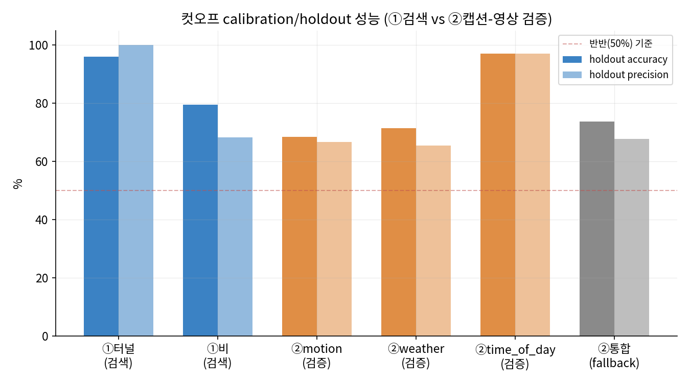

# 검색 후 검증 — 파이프라인 핵심 요약

*전체 실험/시행착오 과정은 `final_report.md`, 한계 전체 목록(25개 항목)은
`KNOWN_LIMITATIONS.md` 참고. 이 문서는 "지금 이 순간의 파이프라인"만
압축해서 정리한 것으로, 과거 버전이나 폐기된 시도는 담지 않는다.*

---

## 무엇인가

회사 주행영상 데이터셋에서 자연어로 원하는 장면을 검색하고(①), 찾아낸 캡션
문장이 실제 영상과 맞는지 별도로 검증해서(②), **검색 관련성과 캡션
신뢰도를 독립된 두 정보로 함께 보여주는** 파이프라인.

## 왜 2단계 구조인가

"이 결과가 검색어와 관련 있는가"와 "이 캡션이 실제로 맞는가"는 다른 질문이다.
실측으로 확인됨: ②로 결과를 필터링해도 검색 관련성은 개선되지 않는다
(verified=True 48.9% vs verified=False 51.5%, 동전 던지기 수준). ②의 역할은
관련성 필터가 아니라 "이 캡션을 얼마나 믿어도 되는지"를 독립적으로 알려주는
것이다.

## 구조

```
검색어(한국어/영어)
    │
    ▼
①검색  src/search_module.py
    - 캡션을 문장 단위로 쪼개 CLIP 텍스트 인코더로 임베딩
    - 코사인 유사도 + CSLS 허브 보정으로 순위
    - 부정문("not congested") 필터링
    - 인덱스는 디스크 캐싱(build_cached_index) - 같은 데이터셋 재실행 시 즉시 로드
    │  (top-K 후보 + 매칭 문장)
    ▼
②검증  src/search_and_verify.py
    - 매칭 문장이 실제 영상과 맞는지 BLIP-ITM으로 대조
    - motion="정지" 주장만 예외: 옵티컬 플로우로 대체
      (BLIP-ITM은 프레임을 독립적으로만 채점해 "정지"의 핵심 증거를 구조적으로 못 봄)
    - 필드별(motion/weather/time_of_day) 임계값 자동 라우팅 + 신뢰도 등급 산출
    │
    ▼
VerifiedSearchResult (search_score, is_relevant, matched_sentence,
                       match_score, is_video_verified, confidence_tier, claims)
```

**CLI**: `python src/run_search_pilot.py "검색어"` (`--feedback`로 관련성 피드백
대화형 모드도 지원)
**새 데이터 연결**: `python src/scan_dataset.py <데이터 루트> --out outputs/search_full_dataset.json`

## 핵심 수치 (전부 holdout 실측치, 지어낸 숫자 없음)

| 필드 | holdout accuracy | 신뢰도 등급 | 검증 규모 |
|---|---|---|---|
| time_of_day | 97.0% | 높음 | 200클립(100/100) |
| motion = "정지" (옵티컬 플로우) | 85.0% | 보통 | 200클립(100/100) |
| weather | 71.5% | 보통 | 200클립(100/100) |
| motion (그 외: 직진/좌우회전/커브) | 68.5% | 낮음 | 200클립(100/100) |



*(200클립 재검증치 기준으로 갱신된 최신 차트. 터널·비는 ①검색 컷오프,
나머지 3개(motion/weather/time_of_day)는 ②검증 필드다.)*

**검색 컷오프(①)**: 검증된 9개 도메인 검색어 중 **터널**(precision 100%,
recall 37.5%)과 **비**(precision/recall 68.3%/68.3%) **2개만** 관련성
컷오프(`is_relevant`)를 확보했다. 이건 740클립 전체를 370/370로 나눠 검증한
결과다. 나머지 7개는 실제 클립 수 자체가 적어(희귀 카테고리) 표본을 늘려도
검증이 안정되지 않아, 컷오프 없이 순위만 제공한다.

## 알려진 한계 (핵심만 — 전체는 `KNOWN_LIMITATIONS.md`)

- **motion 판정("정지" 제외)이 가장 약함** — 68.5%, 동전 던지기보다 약간
  나은 수준. 좌/우회전 방향까지 옵티컬 플로우로 확장 시도했으나 미채택.
- **검증된 검색어 9개 중 7개는 컷오프 없음** — 데이터 희소성이 원인, 버그
  아님.
- **모든 임계값이 이 740클립 데이터셋 전용** — 새 데이터셋은 자동 인식되지만
  (`scan_dataset.py`), 임계값 재보정은 별도로 필요하다.
- **관련성 피드백은 예측 가능한 안전 규칙이 없음** — 그래서 자동 적용 대신
  원본과 나란히 보여주고 사람이 판단하게 설계했다.
- **타임라인(캡션 문장 순서) 일관성 축은 아직 QA에 못 씀** — 측정 도구
  자체의 오차가 커서 별도 보류 중.

## 참고

| 문서 | 용도 |
|---|---|
| `README.md` | 설치/실행법 |
| `results/final_report.md` | 전체 실험/설계 서술형 리포트 |
| `KNOWN_LIMITATIONS.md` | 확인된 한계 전체 목록(25개 항목) |
